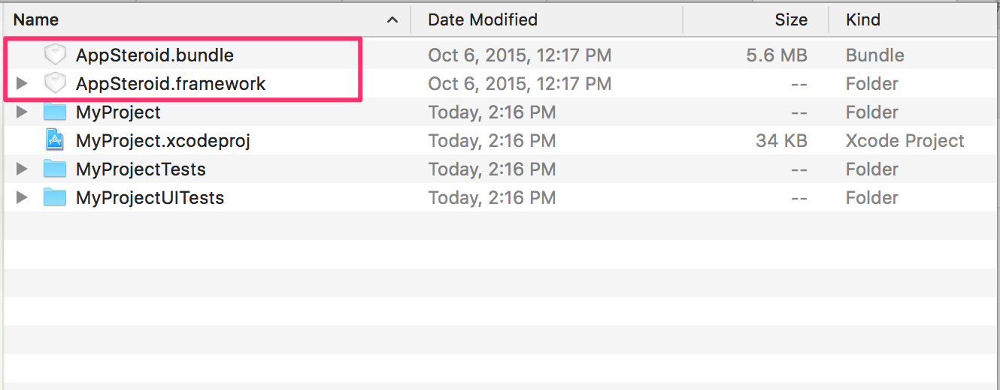
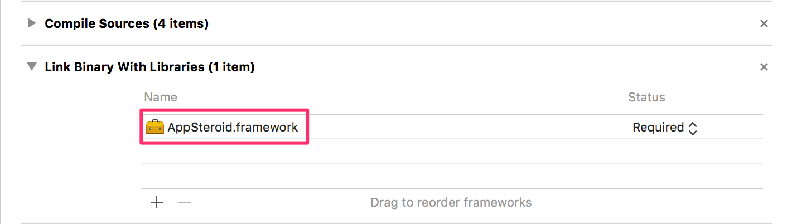
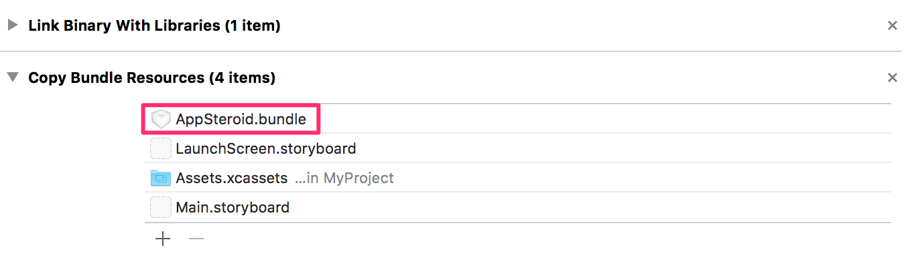
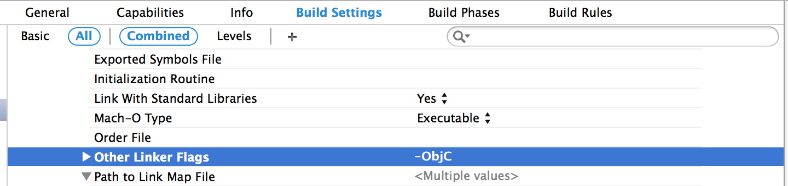

# Get Started with AppSteroid for iOS 

last update at 2015/05/26

---

- [Installation](#Installation)
- [Initial Settings](#Initialization)
- [SignUp & Login](#SignUp&Login)
- [Show AppSteroid Tab](#ShowTab)
- [Login and Show AppSteroidGUI](#Login&ShowTab)

---

AppSteroid for iOS supports iOS7.0 and higher.  
Please make sure you have completed registering your App on the Web Console before implementing the SDK. [How to register your App](./2_AppRegistration.md)

## <a name="Installation"> Installation </a>

1. Download Framework

Download one of the Framework from Fresvii Website.

```
- Framework without Voice Chat
	- appsteroid-ios-X.X.X.zip
- Framework with Voice Chat
	- appsteroid-ios-with-voicechat-X.X.X.zip
```
___To use Voice Chat, please also check [GetStarted-VoiceChat.md](GetStarted/GetStarted-VoiceChat.md#HowToUseAPI) for direction for implementation.___

2. Move the Framework and Bundle into your project directory.


3. Add Framework
Add `AppSteroid.framework` to `Link Binary With Libraries` under `Build Phases`.(Please ignore this step if the framework is already added.)


4. Bundle Addition
Add `AppSteroid.bundle` to `Copy Bundle Resources` under `Build Phases`.(Please ignore this step if the bundle is already added.)


5. Build Settings
Please define the `-ObjC` under `Other Linker Flags`.


## <a name="Initialization"> Initialization </a>

In order to start using AppSteroid, you will need to perform a initial setup when the app launch.
Please define [startWithAppIdentifier:secretToken:](7_Spec.md#AppSteroid.startWithAppIdentifiersecretToken) under [AppSteroid](7_Spec.md#AppSteroid) for `application:didFinishLaunchingWithOptions:` under `AppDelegate.m`.
This API needs to pass the app ID and secret token as an argument. Check [How to register your app](./2_AppRegistration.md) for steps to get your App ID and secret token.

```obj-c
#import <AppSteroid/AppSteroid.h>
                           
    …
    …

- (BOOL)application:(UIApplication *)application
didFinishLaunchingWithOptions:(NSDictionary *)launchOptions
{
    // Start AppSteroid.
    NSString *appId = @"xxxxxxxxxxxxxxxxxxxxxxx";
    NSString *secretToken = @"yyyyyyyyyyyyyyyyyyyyyyyy";
 #ifdef DEBUG
    BOOL development = YES;
 #else
    BOOL development = NO;
 #endif
    [AppSteroid startWithAppIdentifier:appId
                           secretToken:secretToken
                           development:development];
	
	…
	…
	…
	
	return YES;
}
```

## <a name="SignUp&Login"> SignUp to Login </a>

```obj-c
#import <AppSteroid/FASAccount.h>

- (IBAction)pushedAppSteroidButton:(id)sender
{
	FASLoginUser *loginUser = [FASAccount currentLoggedInUser];	
	// When no sing upped user
    if (!loginUser || !loginUser.isSignedUp)
    {
		[FASAccount signUpUserWithCompletion:^(FASLoginUser *loginUser, NSError *error)
		{
			if (error)
			{
				NSLog(@"%@", error);
				return;
			}
		}];
	}
}
```

## <a name="ShowTab"> Easily show the Tab </a>

Show tabs in order of `Forum`,`Leaderboard`,`Messages`,`Profile`.

```obj-c
#import <AppSteroid/FASTabBarController.h>

- (IBAction)pushedTabButton:(id)sender
{
    [FASTabBarController presentTabBarControllerWithTarget:self
                                                  animated:YES];
}
```

## <a name="Login&ShowTab"> Login and show AppSteroid GUI </a>

Please check [Login and show AppSteroid GUI](./5_UseFresviiGUI.md).