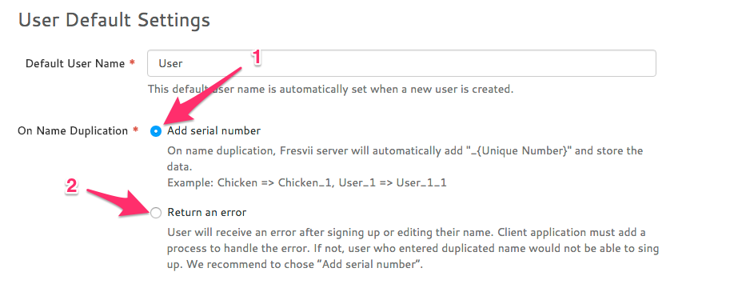

# Behavior on User Name Duplication

You can change the behavior of when an user name is duplicated.   
1. Automatically add a serial number at the end of the duplicated name. 
2. Return an error when an user enter an existing name.  



### Behavior on 1
API would not return an error, but automatically add a serial number at the end of the name.  
For example, if an user name `Chicken` already exist on the data base, the next user who entered `Chicken` will be registered as `Chicken_1`.

### Behavior on 2
On name duplication, store error in NSError object and return with an API.

```
Error Domain=com.fresvii.fresvii-sdk-ios.error Code=2002 "The operation couldn’t be completed. (com.fresvii.fresvii-sdk-ios.error error 2002.)" UserInfo=0x7fe220d1c3e0 {code=0402, message=Validation failed: Name has already been taken, params=<CFBasicHash 0x7fe220dadd40 [0x11469e180]>{type = immutable dict, count = 3,
entries =>
 0 : <CFString 0x7fe220d8bac0 [0x11469e180]>{contents = "name_uniqueness"} = <CFString 0x7fe220d8baf0 [0x11469e180]>{contents = "true"}
 1 : <CFString 0x7fe220d3c370 [0x11469e180]>{contents = "text/plain"} = <CFString 0x7fe220d1c390 [0x11469e180]>{contents = "[""]"}
 2 : <CFString 0x7fe220d8baa0 [0x11469e180]>{contents = "description"} = <CFString 0x7fe220d8baa0 [0x11469e180]>{contents = "description"}
}
, error=ArgumentError}
```

By handling this error, you can inform the user that they cannot use existing name on signup or change name. 
Following is an example of the handling.

```obj-c
- (void)_showErrorAlert:(NSError *)error
{
    NSDictionary *userInfo = error.userInfo;
    if ([userInfo[@"code"] isEqualToString:@"0402"])
    {
        [[[UIAlertView alloc] initWithTitle:@"Error"
                                    message:@"Your user name is duplicated. Please use other user name."
                                   delegate:nil
                          cancelButtonTitle:@"OK"
                          otherButtonTitles:nil] show];
    }
}
```