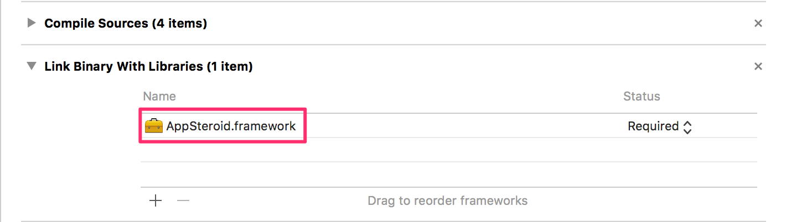

# Get Started

last update at 2014/10/07

---

AppSteroid for iOS supports iOS 6.0 and higher.

## Installation

1. Download Framework

Download one of the Framework from Fresvii Website.

```
- Framework without Voice Chat
	- appsteroid-ios-X.X.X.zip
- Framework with Voice Chat
	- appsteroid-ios-with-voicechat-X.X.X.zip
```
___To use Voice Chat, please also check [GetStarted-VoiceChat.md](GetStarted/GetStarted-VoiceChat.md#HowToUseAPI) for direction for implementation.___


2. Add Framework
Add `AppSteroid.framework` to `Link Binary With Libraries` under `Build Phases`.


3. Bundle Addition
Add `AppSteroid.bundle` to `Copy Bundle Resources` under `Build Phases`.


4. Build Settings
Please define the `-ObjC` under `Other Linker Flags`.


5. In order to start using AppSteroid, you will need to perform a initial setup when starting up the application.
Please define [startWithAppIdentifier:secretToken:](AppSteroidSpec.md#AppSteroid.startWithAppIdentifiersecretToken) under [AppSteroid](AppSteroidSpec.md#AppSteroid) for `application:didFinishLaunchingWithOptions:` under `AppDelegate.m`.
This API needs to pass the app ID and secret token as an argument.

Sample

```
#import <AppSteroid/AppSteroid.h>

    …
    …

- (BOOL)application:(UIApplication *)application
didFinishLaunchingWithOptions:(NSDictionary *)launchOptions
{
    // Start AppSteroid.
    NSString *appId = @"xxxxxxxxxxxxxxxxxxxxxxx";
    NSString *secretToken = @"yyyyyyyyyyyyyyyyyyyyyyyy";
    [AppSteroid startWithAppIdentifier:appId secretToken:secretToken];

	…
	…
	…

	return YES;
}
```

## Show Tab Screen

### Simple Setup

Display tab view in the order of `Forum`,`Leaderboard`,`Profile`.
Check `Select a View to Show on Tab` to specifically choose a view to display on the tab.

Sample

```
#import <AppSteroid/FASTabBarController.h>

	…
	…

- (IBAction)pushedTabButton:(id)sender
{
    [FASTabBarController presentTabBarControllerWithTarget:self
                                                  animated:YES];
}
```

### Select a View to Show on Tab

Displays the tab view by specifying the view that you want to use.
Please check the sample code.

Sample

```
#import <AppSteroid/FASTabBarController.h>

    …
    …

- (IBAction)pushedTabButton:(id)sender
{
    // Forum
    FASForumNavigationController *forumNavigationController = [FASForumNavigationController forumNavigationController];
    forumNavigationController.animated = YES;

    // Leaderboard
    NSString *leaderboardId = [[NSUserDefaults standardUserDefaults] objectForKey:@"leaderboardId"];
    FASSortOptions *dailyOption = [FASSortOptions dailyWithMinute:0 hour:0];
    FASLeaderboardNavigationController *leaderboardNavigationController = [FASLeaderboardNavigationController leaderboardNavigationController];
    leaderboardNavigationController.leaderboardId = leaderboardId;
    leaderboardNavigationController.onlyFriends = NO;
    leaderboardNavigationController.animated = YES;
    leaderboardNavigationController.dailySortOptions = dailyOption;

    // Group
    FASGroupNavigationController *groupNavigationController = [FASGroupNavigationController groupNavigationController];
    groupNavigationController.animated = YES;

    // Profile
    FASProfileNavigationController *profileNavigationController = [FASProfileNavigationController profileNavigationController];
    profileNavigationController.animated = YES;

    NSArray *controllers = @[
                             forumNavigationController,
                             leaderboardNavigationController,
                             groupNavigationController,
                             profileNavigationController
                             ];

    FASTabBarController *tabBarController = [[FASTabBarController alloc] init];
    tabBarController.viewControllers = controllers;
    [self presentViewController:tabBarController
                       animated:YES
                     completion:nil];
}
```
