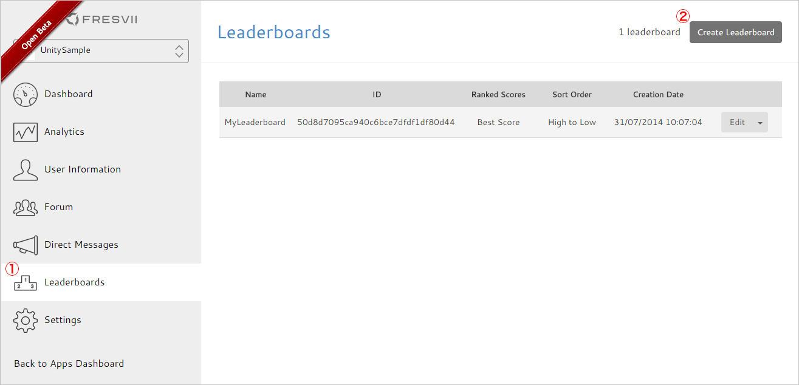
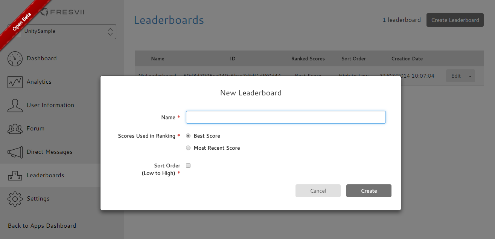
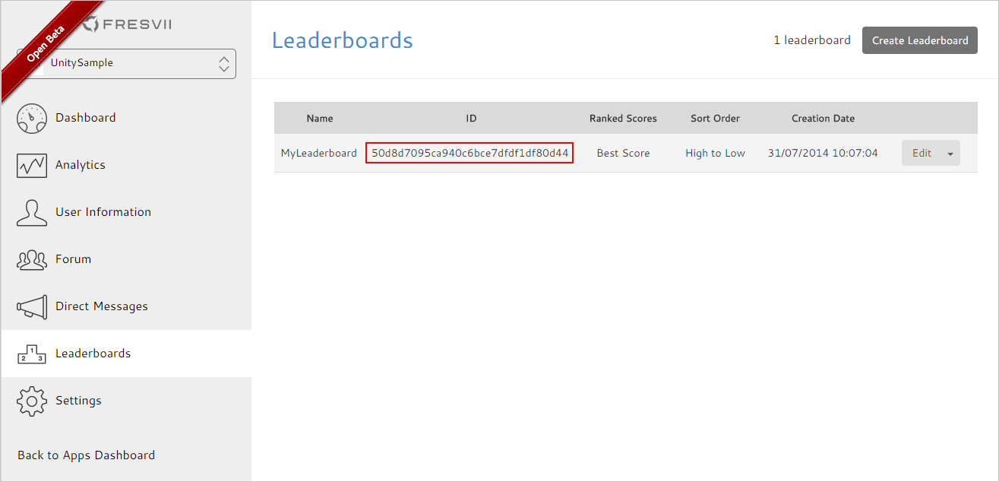

# Getting Started - Leaderboard

last update at 2016/2/1

---

- [About Leaderboard](#AboutLeaderboard)
- [Before using Leaderboard](#PrepareForLeaderboard)
- [How To Use Leaderboard API](#HowToUseAPI)
	- [Submitting Score](#SubmitScore)

---

## <a name="AboutLeaderboard"> About Leaderboard</a>
With AppSteroid leaderboard, developer can easily manage player score and ranking metrics on the Web Console.
Leaderboard store score value in integer.
Three types of format can be selected for the score to be shown on the client GUI. "Regular", "Time", and "Millisecond".

|Type|Description|Example|
|-|-|-|
|Regular|Use the row value data for score. Good for high/low score and stage complete count.|e.g.) score value = 12345 → show 12,345|
|Time|Show score value as time in seconds. |e.g）score value = 12345 → show 3: 25:45|
|Millisecond|Show score value as time in millisecond.  Select the digit count for preciseness. |e.g.）score value = 12345, digit count 2 → show 12.34|

## <a name="PrepareForLeaderboard"> Before using Leaderboard </a>

Create a new Leaderboard on the leaderboard bage. Enter any name to identify this leaderboard.





After the leaderboard is created, Please check the **Leaderboard ID**



## <a name="HowToUseAPI"> How To Use Leaderboard API </a>

### <a name="SubmitScore"> Submitting Score </a>

Use [submitScoreWithLeaderboardId:value:completion:](../Specs/Spec-Leaderboard.md#FASScore.submitScoreWithLeaderboardIdvaluecompletion) in [FASScore](../Specs/Spec-Leaderboard.md#FASScore) to submit score to the target leaderboard.

Sample
Submit a random value, 0 to 1000, as a score.

```
#import <AppSteroid/FASScore.h>

	…
	…

- (IBAction)pushedSubmitButton:(id)sender
{
    NSString *leaderboardId = @"xxxxxxxxxxxxxxxxxx";
    int score = arc4random() % 1000;
    [FASScore submitScoreWithLeaderboardId:leaderboardId
                                     value:score
                                completion:nil];
}
```
