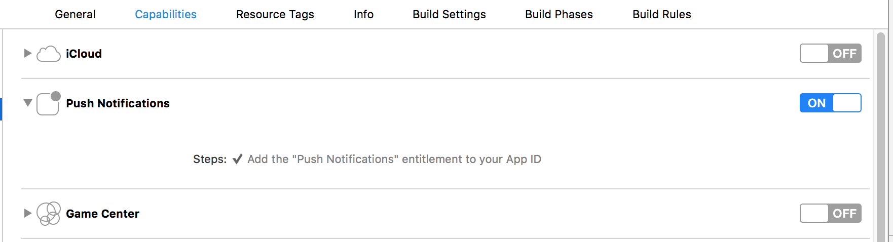

# Getting Started - Push Notification

last update at 2015/07/29

---

- [How To Setup Push Notification](#HowToSetupPushNotification)
- [Implement Codes](#ImplementCodes)
- [Push Notification List](#EventList)
- [Observing Push Notification Event](#ObserveEvent)
- [Sending Custom Message](#CustomMessage)
	- [Setting Channel](#SettingChannel)
	- [Using Storage](#UseKVS)
    - [Sending Message](#SendMessage)
- [Directly Show AppSteroid View](#DisplayFresviiGUI)

---

## <a name="HowToSetupPushNotification"> How To Setup Push Notification </a>
Please see the [Setup](https://github.com/fresvii/appsteroid-documents/blob/master/ja/APNSCertificateTutorial.md) for steps to setup Push Notification.

## <a name="ImplementCodes"> Implement Codes </a>

Please turn on the access of `Capabilities->Push Notifications`.


Implementation on `AppDelegate.h`, like shown below, is required to use push notification.

```
#import <AppSteroid/FASNotification.h>

	…
	…

- (BOOL)application:(UIApplication *)application
didFinishLaunchingWithOptions:(NSDictionary *)launchOptions
{
	…
	…

       float iOSVersion = [[[UIDevice currentDevice] systemVersion] floatValue];
    if(iOSVersion >= 8.0)
    {
        UIUserNotificationSettings *settings = [UIUserNotificationSettings settingsForTypes:(UIRemoteNotificationTypeBadge
                                                                                             |UIRemoteNotificationTypeSound
                                                                                             |UIRemoteNotificationTypeAlert) categories:nil];
        [application registerUserNotificationSettings:settings];
    }
    else
    {
        UIRemoteNotificationType types = UIRemoteNotificationTypeBadge | UIRemoteNotificationTypeAlert | UIRemoteNotificationTypeSound;
        [application registerForRemoteNotificationTypes:types];
    }

    return YES;
}

#pragma mark - Remote Push Notification methods.

- (void)application:(UIApplication *)application
didRegisterForRemoteNotificationsWithDeviceToken:(NSData *)deviceToken
{
    [FASNotification addDeviceToken:deviceToken completion:nil];
}

- (void)application:(UIApplication*)application
didFailToRegisterForRemoteNotificationsWithError:(NSError *)error
{
    LOG(@"Errorinregistration:%@",error);
}
```

## <a name="EventList"> Push Notification List </a>

Please see the [Push Notification Event List](https://github.com/fresvii/appsteroid-documents/blob/master/ja/EventList.md).

## <a name="ObserveEvent"> Observing Push Notification Event </a>

Implementation on `AppDelegate.h`, like shown below, is required to observe push notification event related to AppSteroid.


```
#import <AppSteroid/FASNotification.h>

	…
	…

- (BOOL)application:(UIApplication *)application
didFinishLaunchingWithOptions:(NSDictionary *)launchOptions
{
	…
	…

    [FASNotification handleDidFinishLaunchingWithOptions:launchOptions];

    return YES;
}

- (void)application:(UIApplication *)application
didReceiveRemoteNotification:(NSDictionary *)userInfo
{
    [FASNotification handleDidReceiveRemoteNotification:userInfo];
}

- (void)application:(UIApplication *)application
didReceiveRemoteNotification:(NSDictionary *)userInfo
fetchCompletionHandler:(void (^)(UIBackgroundFetchResult))completionHandler
{
    completionHandler(UIBackgroundFetchResultNewData);
    [FASNotification handleDidReceiveRemoteNotification:userInfo];
}
```

If the settings shown above is completed, using [FASEvent](../Specs/Spec-Notification.md#FASEvent) enables to observe the event.
The code listed below is a sample code to observe friend request event.

Sample

```
#import <AppSteroid/FASEvent.h>

@implementation ViewController
{
    FASObserver *_observer;
}

- (void)viewWillAppear:(BOOL)animated
{
    [super viewWillAppear:animated];

    [self _observeEvent];
}

- (void)viewWillDisappear:(BOOL)animated
{
    [super viewWillDisappear:animated];

    [self _unobserveEvent];
}

- (void)_observeEvent
{
    _observer = [FASEvent observeEventWithPath:@"user/friendship/request"
                                        action:@"created"
                                  eventHandler:^(NSDictionary *params)
    {
        // Details of notification content is stored in params
    }];
}

- (void)_unobserveEvent
{
    [FASEvent unobserve:_observer];
}
```

## <a name="CustomMessage"> Sending Custom Message </a>
[FASCustomMessage](../Specs/Spec-Notification.md#FASCustomMessage) is used to send custom message to a specific user.  It will sent notification to users relevant to the channel setting.  Channel need to be setup on Fresvii web console.

### <a name="SettingChannel"> Setting Channel </a>

Channel can be setup on Fresvii web console.
Please see [Channel Tutorial](https://github.com/fresvii/appsteroid-documents/blob/master/ja/ChannelTutorial.md) for steps to setup.

### <a name="UseKVS"> Using Storage </a>

Please see [Key-Value Storage](../Specs/Spec-Storage.md#FASStorage) for sample to narrow down a user. 
Save a value `10` in the storage, for the key `level`.

Sample

```
#import <AppSteroid/FASStorage.h>

	…
	…

- (IBAction)pushedAddLevelButton:(id)sender
{
    NSDictionary *data = @{@"level" : @"10"};
    [FASStorage addData:data
             completion:^(NSError *error)
    {
        if (error)
        {
            // Error
            return;
        }

        // Success
    }];
}
```

### <a name="SendMessage"> Sending Message </a>

Send message to users who matches `level == 10`.

Sample

```
#import <AppSteroid/FASCustomMessage.h>

	…
	…

- (IBAction)pushedSendMessageToSameLevelUserButton:(id)sender
{
    // Channel name which was set upped on the web console
    NSString *channelName = @"level";
    // Parameter and value which was set upped on the web console
    NSDictionary *channelParams = @{@"bind_level" : @"10"};

    [FASCustomMessage sendMessageWithChannelName:channelName
                                          action:@"created"
                                   channelParams:channelParams
                                          params:nil
                                         subject:@"subject"
                                           sound:nil
                                     apnsEnabled:YES
                                      gcmEnabled:YES
                                      completion:^(FASCustomMessage *message, NSError *error)
    {
        if (error)
        {
            // Error
            return;
        }

        // Success
    }];
}
```

## <a name="DisplayFresviiGUI"> Directly Show AppSteroid View </a>

Directly show the relevant GUI provided by AppSteroid, when the app launches from push notification.
For example, a user can directly jump to "thread A" when receiving a notification about "thread A".  This function is set as a default feature. However, additional setup is required to prevent user to exist the game from a push notification.


```
// Automatically jumps to the target GUI from push notification.
[FASNotification allowsToHandlePushNotification:YES];

// Launch the app by tapping the push notification, but does not jump to the target GUI.
[FASNotification allowsToHandlePushNotification:NO];
```
