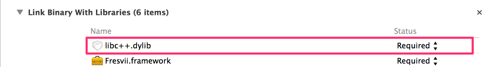
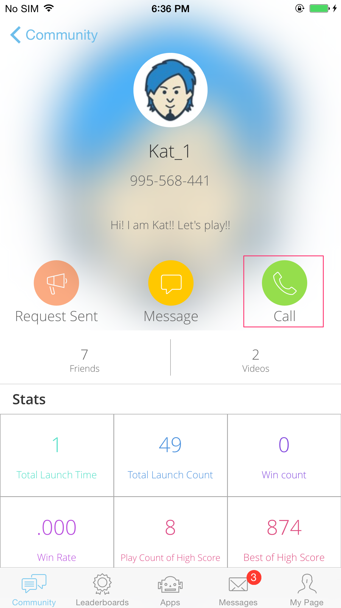
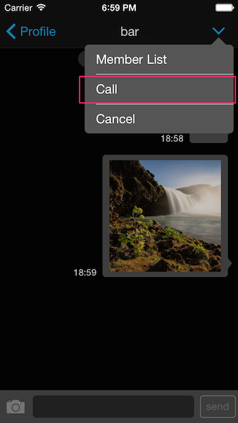
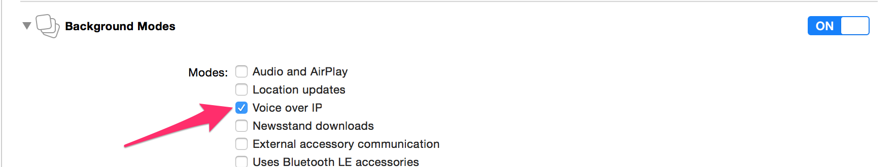

# Getting Started - Voice Chat

last update at 2014/10/08

---

- [How to Use Voice Chat API](#HowToUseAPI)
- [How to display Voice Chat View](#HowToDisplayView)
- [Use in Background mode](#BackgroundMode)

---

## <a name="HowToUseAPI"> How to Use Voice Chat API </a>

### Introduction
Download `flamework with voice chat feature` from Fresvii's website.
Check [AppSteroid Get Started](../AppSteroidGetStarted.md) for instructions to implement the flamework.

Also, add `libc++.dylib` to the library like the sample below.



### Using [FASConference](../Specs/Spec-VoiceChat.md)

Voice Chat can be used by using [FASConference](../Specs/Spec-VoiceChat.md).

#### Start Voice Chat

A group needs to be created before starting a voice chat.
Check [GetStarted-GroupChat](GetStarted-GroupChat.md#HowToCreateGroup) for creating a group.
Start a voice chat by selecting a group ID in [setupConferenceWithGroupId:completion:](../Specs/Spec-VoiceChat.md#FASConference.setupConferenceWithGroupIdcompletion) on [FASConference](../Specs/Spec-VoiceChat.md).

Sample

```
- (void)startVoiceChat
{
    NSString *groupId = @"xxxxxxxxxxxxxxxxxxx";
    [FASConference setupConferenceWithGroupId:groupId
                                   completion:^(id response, NSError *error)
     {
         if (error)
         {
             // Error
             return;
         }
         // Start voice chat
     }];
}
```

#### Join Voice Chat

Player can not join a voice chat that hasn't started yet.
Join a voice chat by selecting a group ID in [joinConferenceWithGroupId:completion:](../Specs/Spec-VoiceChat.md#FASConference.joinConferenceWithGroupIdcompletion) on [FASConference](../Specs/Spec-VoiceChat.md).

Sample

```
- (void)joinVoiceChat
{
    NSString *groupId = @"xxxxxxxxxxxxxxxxxxx";
    [FASConference joinConferenceWithGroupId:groupId
                                  completion:^(id response, NSError *error)
    {
        if (error)
        {
            // Error
            return;
        }
        // Join voice chat completed
    }];
}
```

#### Leave Voice Chat

Leave from a voice chat group.
Leave a voice chat by selecting a group ID in [leaveConferenceWithCompletion:](../Specs/Spec-VoiceChat.md#FASConference.leaveConferenceWithCompletion) on  [FASConference](../Specs/Spec-VoiceChat.md).

Sample

```
- (void)leaveVoiceChat
{
    [FASConference leaveConferenceWithCompletion:^(id response, NSError *error)
    {
        if (error)
        {
            // Error
            return;
        }
        // Leave voice chat completed
    }];
}
```

## <a name="HowToDisplayView"> How to display Voice Chat View </a>

Voice chat can be used using the GUI provided by AppSteroid.
Tapping the green call button on the profile screen will start a 1:1 voice chat.



Tap the Call button on the top right menu to start a voice chat in a group chat screen.  4 person in maximum can be in the same voice chat call.



## <a name="BackgroundMode"> Use in Background mode </a>
Applications goes to sleep mode while it is on background. To avoid the sleep, you need to add permission in info.plist, for the app to be activated on background. To activate voice chat on background mode, switch `Voice over IP` setting to `on` in `Background Modes` of `Capabillities`.

