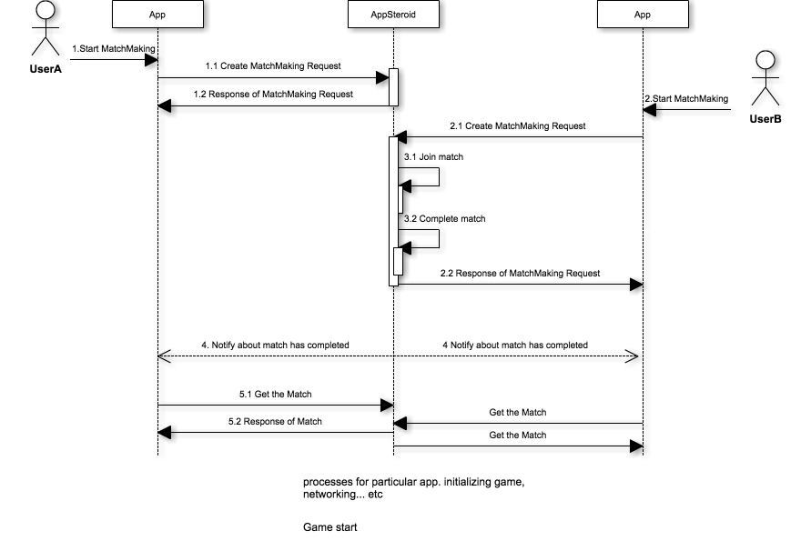
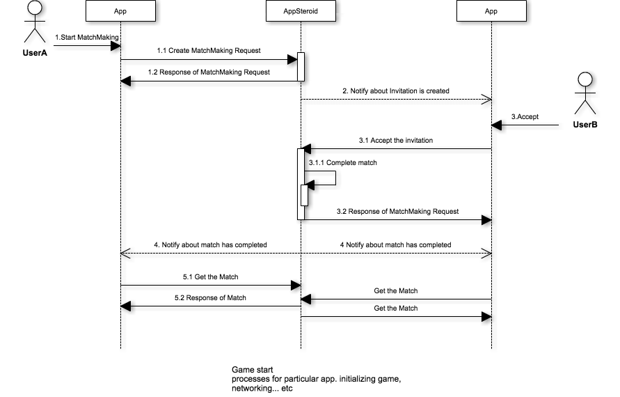
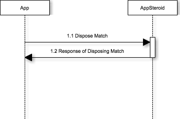

# Matchmaking Specifications

last update at 2015/4/2

---

## Introduction

Specification for functions related to Matchmaking.
Players can find users who want to play the game together. We also provide a Matchmaking GUI, which you can check [MatchmakingGetStarted](../GetStarted/GetStarted-Matchmaking.md) for more information.

---

## Sequence

#### At the Start of Matchmake (Regular Match)


- 1.1 An user create a new matchmake request.
- 1.2 Response the result of request creation. Match status: FASMatchStatusWating
- 2.1 A new matchmake request created by other users.
- 3.1 (If there is an existing match to join) Join a Match.
- 3.2 (If participants reach the maximum capacity of the match) Match is completed.
- 2.2 Response the result of request creation. Match status: FASMatchStatusComplete
- 4 Notify match completion event to all match participants.
- 5.1 Get the latest match invitation info.
- 5.2 Response the match detail.

#### At the Start of Matchmake (Friend Match by Invitation)


- 1.1 An user create a new matchmake request.
- 1.2 Response the result of request creation. Match status: FASMatchStatusInviting
- 2. Notify matchmake invitation event to joiner.
- 3.1 Accept invitation.
- 3.2 (If participants reach the maximum capacity of the match) Match is completed.
- 4 Notify match completion event to all match participants.
- 5.1 Get the latest match invitation info.
- 5.2 Response the match detail.




- 1.1 Dispose the needless match.
- 1.2 Response the result of match disposal. Match status: FASMatchStatusDisposed

Match status will transit in the following order.

1. FASMatchStatusWating: Waiting to reach the maximum capacity of the match.
2. (FASMatchStatusInviting): Participants reached the maximum capacity but still waiting for joiners to accept the invitation.
3. FASMatchStatusComplete: Participants reached the maximum capacity of the match, or executed force completion. Game can be started anytime.
4. FASMatchStatusDisposed: Game is finished and match has been disposed.


## Classes

|Class|Description|
|------|-----|
|[FASMatch](#FASMatch)|Match model class |
|[FASMatchRequest](#FASMatchRequest)|Match request model class |
|[FASMatchPlayer](#FASMatchPlayer)|Match player model class |
|[FASMatchInvitation](#FASMatchInvitation)|Match invitation model class |
|[FASGameContext](#FASGameContext)|Game context model class |
|[FASMatchmakingNavigationController](#FASMatchmakingNavigationController)|NavigationController, which is a base of Matchmaking |
|[FASMatchmakingLayout](#FASMatchmakingLayout)|Class to change layout of Matchmaking View |

---

## APIs
### <a name="FASMatch"> FASMatch </a>
Match model class, which will be generated when a matching happens from a request or a invitation.

#### Constants

|Constant|Description|
|------|-----|
|[FASMatchSearchingStatus](#FASMatch.FASMatchSearchingStatus)|Parameter to narrow down search result when getting multiple matches. |
|[FASMatchStatus](#FASMatch.FASMatchStatus)|Match status. |
|[FASMatchCompletionHandler](#FASMatch.FASMatchCompletionHandler)|Block object used when carrying out the process to get a Match. |
|[FASMatchesCompletionHandler](#FASMatch.FASMatchesCompletionHandler)|Block object used when carrying out the process to get multiple Matches. |

##### <a name="FASMatch.FASMatchSearchingStatus"> FASMatchSearchingStatus </a>
Parameter to narrow down search result when getting multiple matches. [fetchMatchesWithPage:status:completion:](#FASMatch.fetchMatchesWithPagestatuscompletion)の`status`の引数で利用します。

```
typedef NS_ENUM(NSInteger, FASMatchSearchingStatus)
{
    FASMatchSearchingStatusMatching,
    FASMatchSearchingStatusComplete
};
```

###### Constants
###### FASMatchSearchingStatusMatching
A Status showing that the matching is incomplete and still waiting for players to join.

###### FASMatchSearchingStatusComplete
A Status showing that the matching is completed with players and ready to start the game.


#### <a name="FASMatch.FASMatchStatus"> FASMatchStatus </a>
Match status

```
typedef NS_ENUM(NSInteger, FASMatchStatus)
{
    FASMatchStatusInvalid = -1,
    FASMatchStatusWating,
    FASMatchStatusInviting,
    FASMatchStatusComplete,
    FASMatchStatusDisposed
};
```

###### Constants
###### FASMatchStatusInvalid
Used when a invalid status was returned.

###### FASMatchStatusWating
A status waiting for other players to join.

###### FASMatchStatusInviting
A status showing that all players needed for the match are invited.

###### FASMatchStatusComplete
A Status showing that the matching is completed with players and ready to start the game.

###### FASMatchStatusDisposed
A Status showing it is ready to dispose the match, after the game is finish.

##### <a name="FASMatch.FASMatchCompletionHandler"> FASMatchCompletionHandler </a>
Block object used when carrying out the process to get a specific Match.

typedef void (^ FASMatchCompletionHandler)(FASMatch *match, NSError *error);

* Parameters
	* match
		* [FASMatch](#FASMatch) is stored.
	* error
		* Error detail is stored. It will be nil if there is no error.

##### <a name="FASMatch.FASMatchesCompletionHandler"> FASMatchesCompletionHandler </a>
Block object used when carrying out the process to get multiple Matches.

typedef void (^ FASMatchesCompletionHandler)(NSArray *matches, FASPagingMeta *meta, NSError *error);

* Parameters
	* matches
		* Multiple [FASMatch](#FASMatch) are stored in NSArray.
	* meta
		* You can refer meta-information such as total number of list or current page number. Check [FASPagingMeta](../7_Spec.md#FASPagingMeta) for more information.
	* error
		* Error detail is stored. It will be nil if there is no error.

#### Properties

|Properties|Description|
|------|-----|
|[matchId](#FASMatch.matchId)|Match ID |
|[status](#FASMatch.status)|Match Status |
|[currentMinPlayers](#FASMatch.currentMinPlayers)|Current minimum players |
|[currentMaxPlayers](#FASMatch.currentMaxPlayers)|Current maximum players |
|[createdAt](#FASMatch.createdAt)|Time of when match was created |
|[updatedAt](#FASMatch.updatedAt)|Time of when match was updated |
|[players](#FASMatch.players)|Players who are joining the match |
|[groups](#FASMatch.groups)|Groups that are joining the match |

##### <a name="FASMatch.matchId"> matchId </a>
Match ID

@property (nonatomic, readonly) NSString *matchId;

##### <a name="FASMatch.status"> status </a>
Match Status

@property (nonatomic, readonly) FASMatchStatus status;

##### <a name="FASMatch.currentMinPlayers"> currentMinPlayers </a>
Current minimum players

@property (nonatomic, readonly) NSUInteger currentMinPlayers;

##### <a name="FASMatch.currentMaxPlayers"> currentMaxPlayers </a>
Current maximum players

@property (nonatomic, readonly) NSUInteger currentMaxPlayers;

##### <a name="FASMatch.createdAt"> createdAt </a>
Time of when match was created

@property (nonatomic, readonly) NSDate *createdAt;

##### <a name="FASMatch.updatedAt"> updatedAt </a>
Time of when match was updated

@property (nonatomic, readonly) NSDate *updatedAt;

##### <a name="FASMatch.players"> players </a>
Players who are joining or currently invited to the match. [FASMatchPlayer](#FASMatchPlayer) is stored.

@property (nonatomic, readonly) NSArray *players;

##### <a name="FASMatch.groups"> groups </a>
Group of players who are in the match after matching was completed. [FASGroup](./Spec-Group.md#FASGroup) is stored.

@property (nonatomic, readonly) NSArray *groups;

#### Class Method

|Method|Description|
|------|-----|
|[fetchMatchWithMatchId:completion:](#FASMatch.fetchMatchWithMatchIdcompletion) |Get Match with a specified match ID. |
|[fetchMatchesWithPage:completion:](#FASMatch.fetchMatchesWithPagecompletion) |Get all matches. |
|[fetchMatchesWithPage:status:completion:](#FASMatch.fetchMatchesWithPagestatuscompletion) |Get Match with a specified status. |
|[joinMatchWithMatchId:completion:](#FASMatch.joinMatchWithMatchIdcompletion) |Join Match with a specified match ID. |
|[desposeMatchWithMatchId:completion:](#FASMatch.desposeMatchWithMatchIdcompletion) |Dispose Match with a specified match ID. |
|[completeMatchWithMatchId:completion:](#FASMatch.completeMatchWithMatchIdcompletion) |Complete the selected match ID's match. |


##### <a name="FASMatch.fetchMatchWithMatchIdcompletion"> fetchMatchWithMatchId:completion: </a>
Get Match with a specified match ID.

\+ (void)fetchMatchWithMatchId:(NSString *)matchId
                    completion:(FASMatchCompletionHandler)completion;

* Parameters
	* matchId
		* Match ID
	* completion
		* Block object to be executed when the process is completed.

Sample

```
#import <AppSteroid/FASMatch.h>

	…
	…

- (IBAction)pushedFetchButton:(id)sender
{
    NSString *matchId = @“xxxxxxxxxxxxxxxxxx”;
  [FASMatch fetchMatchWithMatchId:matchId
                       completion:^(FASMatch *match, NSError *error)
  {
        // It will be called when the process is completed.
    }];
}
```

##### <a name="FASMatch.fetchMatchesWithPagecompletion"> fetchMatchesWithPage:completion: </a>
Get all matches.

\+ (void)fetchMatchesWithPage:(NSUInteger)page
                   completion:(FASMatchesCompletionHandler)completion;

* Parameters
	* page
		* Page number
	* completion
		* Block object to be executed when the process is completed.

Sample

```
#import <AppSteroid/FASMatch.h>

	…
	…

- (IBAction)pushedFetchButton:(id)sender
{
  [FASMatch fetchMatchesWithPage:1
                     completion:^(NSArray *matches, FASPagingMeta *meta, NSError *error)
  {
        // It will be called when the process is completed.
    }];
}
```

##### <a name="FASMatch.fetchMatchesWithPagestatuscompletion"> fetchMatchesWithPage:status:completion: </a>
Get Match with a specified status.

\+ (void)fetchMatchesWithPage:(NSUInteger)page
                       status:(FASMatchSearchingStatus)status
                   completion:(FASMatchesCompletionHandler)completion;

* Parameters
	* page
		* Page number
	* status
		* Select status from [FASMatchSearchingStatus](#FASMatch.FASMatchSearchingStatus).
	* completion
		* Block object to be executed when the process is completed.


Sample

```
#import <AppSteroid/FASMatch.h>

	…
	…

- (IBAction)pushedFetchButton:(id)sender
{
  [FASMatch fetchMatchesWithPage:1
                          status:FASMatchSearchingStatusComplete
                      completion:^(NSArray *matches, FASPagingMeta *meta, NSError *error)
  {
        // It will be called when the process is completed.
    }];
}
```

##### <a name="FASMatch.joinMatchWithMatchIdcompletion"> joinMatchWithMatchId:completion: </a>
Join Match with a specified match ID.

\+ (void)joinMatchWithMatchId:(NSString *)matchId
                   completion:(FASMatchCompletionHandler)completion;

* Parameters
	* matchId
		* Match ID
	* completion
		* Block object to be executed when the process is completed.

Sample

```
#import <AppSteroid/FASMatch.h>

	…
	…

- (IBAction)pushedJoinButton:(id)sender
{
    NSString *matchId = @“xxxxxxxxxxxxxxxxxx”;
  [FASMatch joinMatchWithMatchId:matchId
                      completion:^(NSMatch *match, NSError *error)
  {
        // It will be called when the process is completed.
    }];
}
```

##### <a name="FASMatch.desposeMatchWithMatchIdcompletion"> desposeMatchWithMatchId:completion: </a>
Dispose Match with a specified match ID.

\+ (void)desposeMatchWithMatchId:(NSString *)matchId
                      completion:(FASMatchCompletionHandler)completion;

* Parameters
	* matchId
		* Match ID
	* completion
		* Block object to be executed when the process is completed.


Sample

```
#import <AppSteroid/FASMatch.h>

	…
	…

- (IBAction)pushedDesposeButton:(id)sender
{
    NSString *matchId = @“xxxxxxxxxxxxxxxxxx”;
  [FASMatch desposeMatchWithMatchId:matchId
                         completion:^(NSMatch *match, NSError *error)
  {
        // It will be called when the process is completed.
    }];
}
```

##### <a name="FASMatch.completeMatchWithMatchIdcompletion"> completeMatchWithMatchId:completion: </a>
Complete the selected match ID's match.  
If the number of participating players reach the minimum required players, [FASMatchStatus](#FASMatch.FASMatchStatus) will change to `FASMatchStatusComplete`. If it dose not reach the minimum required players, the status will remain `FASMatchStatusDisposed`.

\+ (void)completeMatchWithMatchId:(NSString *)matchId
                       completion:(FASMatchCompletionHandler)completion;

* Parameters
	* matchId
		* Match ID
	* completion  
		* Block object to be executed when the process is completed.

### <a name="FASMatchPlayer"> FASMatchPlayer </a>
Match player Class. A model class of players who participate in a match.

#### Constants

|Constant|Description|
|------|-----|
|[FASMatchPlayerStatus](#FASMatchPlayer.FASMatchPlayerStatus)|Status of match player |

##### <a name="FASMatchPlayer.FASMatchPlayerStatus"> FASMatchPlayerStatus </a>
Status of match player

```
typedef NS_ENUM(NSInteger, FASMatchInvitationStatus)
{
    FASMatchPlayerStatusInvalid = -1,
    FASMatchPlayerStatusInvited,
    FASMatchPlayerStatusAccepted,
    FASMatchPlayerStatusMatched,
    FASMatchPlayerStatusDeclined,
    FASMatchPlayerStatusExpired,
    FASMatchPlayerStatusMatching
};
```

###### Constants
###### FASMatchPlayerStatusInvalid
Used when an invalid status was returned.

###### FASMatchPlayerStatusInvited
Status, received invitation.

###### FASMatchPlayerStatusAccepted
Status, accepted invitation.

###### FASMatchPlayerStatusMatched
Status, currently matching.

###### FASMatchPlayerStatusDeclined
Status, declined invitation.

###### FASMatchPlayerStatusExpired
Status, match request has expired.

###### FASMatchPlayerStatusMatching
Status, searching for a match.

#### Properties

|Properties|Description|
|------|-----|
|[requestId](#FASMatchRequest.requestId)|Match request ID |
|[status](#FASMatchPlayer.status)|Status of a matched player |
|[user](#FASMatchPlayer.user)|Player information |
|[match](#FASMatchRequest.match)|Match object that can be fetched when a player matches |
|[createdAt](#FASMatchRequest.createdAt)|Time of when the match request was created |
|[updatedAt](#FASMatchRequest.updatedAt)|Time of when the match request was updated |

##### <a name="FASMatchRequest.requestId"> requestId </a>
Match request ID

@property (nonatomic, readonly) NSString *requestId;
##### <a name="FASMatchPlayer.status"> status </a>
Status of a matched player

@property (nonatomic, readonly) FASMatchPlayerStatus status;

##### <a name="FASMatchPlayer.user"> user </a>
Player information

@property (nonatomic, readonly) FASUser *user;

##### <a name="FASMatchRequest.match"> match </a>
Match object that can be fetched when a player matches

@property (nonatomic, readonly) FASMatch *match;

##### <a name="FASMatchRequest.createdAt"> createdAt </a>
Time of when the match request was created

@property (nonatomic, readonly) NSDate *createdAt;

##### <a name="FASMatchRequest.updatedAt"> updatedAt </a>
Time of when the match request was updated

@property (nonatomic, readonly) NSDate *updatedAt;


### <a name="FASMatchRequest"> FASMatchRequest </a>
Match request model class, which will create a request for a new match.
[FASMatchPlayer](#FASMatchPlayer) is the parent class.

#### Constants

|Constant|Description|
|------|-----|
|[FASMatchRequestStatus](#FASMatchRequest.FASMatchRequestStatus)|Match request status. |
|[FASMatchRequestCompletionHandler](#FASMatchRequest.FASMatchRequestCompletionHandler)|Block object used when carrying out the process to get match request. |

##### <a name="FASMatch.FASMatchSearchingStatus"> FASMatchSearchingStatus </a>
Match request status.

```
typedef NS_ENUM(NSInteger, FASMatchRequestStatus)
{
    FASMatchRequestStatusInvalid = -1,
    FASMatchRequestStatusMatching,
    FASMatchRequestStatusMatched
};
```

###### Constants
###### FASMatchRequestStatusInvalid
Used when a invalid status was returned.

###### FASMatchRequestStatusMatching
A status looking for opponents.

###### FASMatchRequestStatusMatched
A status showing that an opponents was found and matched.

##### <a name="FASMatchRequest.FASMatchRequestCompletionHandler"> FASMatchRequestCompletionHandler </a>
Block object used when carrying out the process to get match request.

typedef void (^FASMatchRequestCompletionHandler)(FASMatchRequest *matchRequest, NSError *error);

* Parameters
	* matchRequest
		* [FASMatchRequest](#FASMatchRequest) is stored.
	* error
		* Error detail is stored. It will be nil if there is no error.

#### Properties

|Properties|Description|
|------|-----|
|[segment](#FASMatchRequest.segment)|Match segment. Only match users with a same segment. |
|[minNumberOfPlayers](#FASMatchRequest.minNumberOfPlayers)|Requested minimum number of players |
|[maxNumberOfPlayers](#FASMatchRequest.maxNumberOfPlayers)|Requested maximum number of players |

##### <a name="FASMatchRequest.segment"> segment </a>
Match segment. Only match users with a same segment.

@property (nonatomic, readonly) NSString *segment;

##### <a name="FASMatchRequest.minNumberOfPlayers"> minNumberOfPlayers </a>
Requested minimum number of players

@property (nonatomic, readonly) NSUInteger minNumberOfPlayers;

##### <a name="FASMatchRequest.maxNumberOfPlayers"> maxNumberOfPlayers </a>
Requested maximum number of players

@property (nonatomic, readonly) NSUInteger maxNumberOfPlayers;

#### Class Method

|Method|Description|
|------|-----|
|[createMatchRequestWithCompletion:](#FASMatchRequest.createMatchRequestWithCompletion) |Create a match request. |
|[createMatchRequestWithMinNumberOfPlayers:maxNumberOfPlayers:segment:completion:](#FASMatchRequest.createMatchRequestWithMinNumberOfPlayersmaxNumberOfPlayerssegmentcompletion) |Create a match request with specific conditions, minimum/maximum number of players and segment. |
|[createMatchRequestWithMinNumberOfPlayers:maxNumberOfPlayers:inviteUsers:inviteMessages:segment:completion:](#FASMatchRequest.createMatchRequestWithMinNumberOfPlayersmaxNumberOfPlayersinviteUsersinviteMessagessegmentcompletion) |Create a match request by selecting user to invite with an invitation message, and with specific conditions, minimum/maximum number of players and segment. |
|[createMatchRequestWithMinNumberOfPlayers:maxNumberOfPlayers:inviteUsers:inviteMessages:segment:cancelOnDecline:completion:](#FASMatchRequest.createMatchRequestWithMinNumberOfPlayersmaxNumberOfPlayersinviteUsersinviteMessagessegmentcancelOnDeclinecompletion) |Create a match request by selecting the Minimum/Maximum number of game players and segmentation, user who invites and invitation message, behavior of when canceling a invitation. |
|[cancelMatchRequestWithRequestId:completion:](#FASMatchRequest.cancelMatchRequestWithRequestIdcompletion) |Cancel a match request |
|[fetchMatchingRequestWithCompletion:](#FASMatchRequest.fetchMatchingRequestWithCompletion) |Get own match request. |

##### <a name="FASMatchRequest.createMatchRequestWithCompletion"> createMatchRequestWithCompletion: </a>
Create a match request.

\+ (void)createMatchRequestWithCompletion:(FASMatchRequestCompletionHandler)completion;

* Parameters
	* completion
		* Block object to be executed when the process is completed.

Sample

```
#import <AppSteroid/FASMatchRequest.h>

	…
	…

- (IBAction)pushedCreateButton:(id)sender
{
  [FASMatchRequest createMatchRequestWithCompletion:^(FASMatchRequest *matchRequest, NSError *error)
  {
        // It will be called when the process is completed.
    }];
}
```

##### <a name="FASMatchRequest.createMatchRequestWithMinNumberOfPlayersmaxNumberOfPlayerssegmentcompletion"> createMatchRequestWithMinNumberOfPlayers:maxNumberOfPlayers:segment:completion: </a>
Create a match request with specific conditions, minimum/maximum number of players and segment.

\+ (void)createMatchRequestWithMinNumberOfPlayers:(NSUInteger)minNumber
                               maxNumberOfPlayers:(NSUInteger)maxNumber
                                          segment:(NSString *)segment
                                       completion:(FASMatchRequestCompletionHandler)completion;

* Parameters
	* nimNumber
		* Minimum number of players, which can be selected between 2 to 16.
	* maxNumber
		* Maximum number of players, which can be selected between 2 to 16.
	* segment
		* Only matches users with a same segment when it is specified.
	* completion
		* Block object to be executed when the process is completed.

Sample

```
#import <AppSteroid/FASMatchRequest.h>

	…
	…

- (IBAction)pushedCreateButton:(id)sender
{
  [FASMatchRequest createMatchRequestWithMinNumberOfPlayers:3
                                         maxNumberOfPlayers:6
                                                    segment:@“beginner”
                                                 completion:^(FASMatchRequest *matchRequest, NSError *error)
  {
        // It will be called when the process is completed.
    }];
}
```

##### <a name="FASMatchRequest.createMatchRequestWithMinNumberOfPlayersmaxNumberOfPlayersinviteUsersinviteMessagessegmentcompletion"> createMatchRequestWithMinNumberOfPlayers:maxNumberOfPlayers:inviteUsers:inviteMessages:segment:completion: </a>
Create a match request by selecting user to invite with an invitation message, and with specific conditions, minimum/maximum number of players and segment.

\+ (void)createMatchRequestWithMinNumberOfPlayers:(NSUInteger)minNumber
                               maxNumberOfPlayers:(NSUInteger)maxNumber
                                      inviteUsers:(NSArray *)users
                                   inviteMessages:(NSArray *)messages
                                          segment:(NSString *)segment
                                       completion:(FASMatchRequestCompletionHandler)completion;

* Parameters
	* minNumber
		* Minimum number of players, which can be selected between 2 to 16.
	* maxNumber
		* Maximum number of players, which can be selected between 2 to 16.
	* users
		* Specify a user to invite with an ID array.
	* messages
		* Select a invitation message to invite user.
	* segment
		* Only matches users with a same segment when it is specified.
	* completion
		* Block object to be executed when the process is completed.

Sample

```
#import <AppSteroid/FASMatchRequest.h>

	…
	…

- (IBAction)pushedCreateButton:(id)sender
{
    NSArray *users = @[@“xxxxxxxxxxxxx”, @“yyyyyyyyyyyyyyyy”];
    NSArray *messages = @[@“Let’s play!”, @“Let’s play!”];
  [FASMatchRequest createMatchRequestWithMinNumberOfPlayers:3
                                         maxNumberOfPlayers:6
                                                inviteUsers:users
                                             inviteMessages:messages
                                                    segment:@“beginner”
                                                 completion:^(FASMatchRequest *matchRequest, NSError *error)
  {
        // It will be called when the process is completed.
    }];
}
```

##### <a name="FASMatchRequest.createMatchRequestWithMinNumberOfPlayersmaxNumberOfPlayersinviteUsersinviteMessagessegmentcancelOnDeclinecompletion"> createMatchRequestWithMinNumberOfPlayers:maxNumberOfPlayers:inviteUsers:inviteMessages:segment:cancelOnDecline:completion: </a>
Create a match request by selecting the Minimum/Maximum number of game players and segmentation, user who invites and invitation message, behavior of when canceling a invitation.

\+ (void)createMatchRequestWithMinNumberOfPlayers:(NSUInteger)minNumber
                               maxNumberOfPlayers:(NSUInteger)maxNumber
                                      inviteUsers:(NSArray *)users
                                   inviteMessages:(NSArray *)messages
                                          segment:(NSString *)segment
                                  cancelOnDecline:(BOOL)cancelOnDecline
                                       completion:(FASMatchRequestCompletionHandler)completion;

* Parameters
	* minNumber
		* Minimum number of players. Value between 2 to 16.
	* maxNumber
		* Maximum number of players. Value between 2 to 16.
	* users
		* Select ID of a user to invite with string.
	* messages
		* Select invitation message for a user to invite.
	* segment
		* If selected, only match with a player in the same segment.
	* cancelOnDecline
		* Behavior of when declining a invitation.  
		  If `YES`: Cancel the invitation and the match will wait for other player to join. If
          `NO`: Invitation won't be canceled and a blank player will remain in the match with a declined status. When the number of participants cover the maximum number of player, other player cannot join the match.
	* completion
		* Block object to be executed when the process is completed.

##### <a name="FASMatchRequest.acceptMatchRequestWithRequestIdcompletion"> acceptMatchRequestWithRequestId:completion: </a>
Accept match invitation.

\+ (void)acceptMatchRequestWithRequestId:(NSString *)requestId
                              completion:(FASMatchRequestCompletionHandler)completion;

* Parameters
	* requestId
		* Request ID
	* completion
		* Block object to be executed when the process is completed.

Sample

```
#import <AppSteroid/FASMatchRequest.h>

	…
	…

- (IBAction)pushedAcceptButton:(id)sender
{
  [FASMatchRequest acceptMatchRequestWithRequestId:@“xxxxxxxxxxxxxxxx”
                                        completion:^(FASMatchRequest *matchRequest, NSError *error)
  {
        // It will be called when the process is completed
    }];
}
```

#### <a name="FASMatchRequest.cancelMatchRequestWithRequestIdcompletion"> cancelMatchRequestWithRequestId:completion: </a>
Reject match invitation.

\+ (void)cancelMatchRequestWithRequestId:(NSString *)requestId
                              completion:(FASMatchRequestCompletionHandler)completion;

* Parameters
	* requestId
		* Request ID.
	* completion
		* Block object to be executed when the process is completed.

Sample

```
#import <AppSteroid/FASMatchRequest.h>

	…
	…

- (IBAction)pushedCancelButton:(id)sender
{
  [FASMatchRequest cancelMatchRequestWithRequestId:@“xxxxxxxxxxxxxxxx”
                                        completion:^(FASMatchRequest *matchRequest, NSError *error)
  {
        // It will be called when the process is completed.
    }];
}
```

#### <a name="FASMatchRequest.fetchMatchingRequestWithCompletion"> fetchMatchingRequestWithCompletion: </a>
Get own match request.

\+ (void)fetchMatchingRequestWithCompletion:(FASMatchRequestCompletionHandler)completion;

* Parameters
	* completion
		* Block object to be executed when the process is completed.

Sample

```
#import <AppSteroid/FASMatchRequest.h>

	…
	…

- (IBAction)pushedFetchButton:(id)sender
{
  [FASMatchRequest fetchMatchingRequestWithCompletion:^(FASMatchRequest *matchRequest, NSError *error)
  {
        // It will be called when the process is completed.
    }];
}
```


### <a name="FASMatchInvitation"> FASMatchInvitation </a>
Match invitation model class. It will be created when inviting a player using match request.   
[FASMatchPlayer](#FASMatchPlayer) is the parent class.

#### Properties

|Properties|Description|
|------|-----|
|[invitationMessage](#FASMatchInvitation.invitationMessage)|Invitation message |
|[invitingUser](#FASMatchInvitation.invitingUser)|User who send the invitation |

##### <a name="FASMatchInvitation.invitationMessage"> invitationMessage </a>
Invitation message

@property (nonatomic, readonly) NSString *invitationMessage;

##### <a name="FASMatchInvitation.invitingUser"> invitingUser </a>
Player who invited

@property (nonatomic, readonly) FASUser *invitingUser;

#### Class Method

|Method|Description|
|------|-----|
|[inviteUserWithRequestId:opponentUserId:message:cancelOnDecline:completion:](#FASMatchInvitation.inviteUserWithRequestIdopponentUserIdmessagecancelOnDeclinecompletion) |Add user to a existing request |
|[acceptMatchRequestWithRequestId:completion:](#FASMatchInvitation.acceptMatchRequestWithRequestIdcompletion) |Accept invitation |
|[declineMatchRequestWithRequestId:completion:](#FASMatchInvitation.declineMatchRequestWithRequestIdcompletion) |Decline invitation |

\+ (void)inviteUserWithRequestId:(NSString *)requestId
                 opponentUserId:(NSString *)userId
                        message:(NSString *)message
                cancelOnDecline:(BOOL)cancelOnDecline
                     completion:(FASMatchInvitationCompletionHandler)completion;

* Parameters
	* requestId
		* Request ID
	* userId
		* User ID to invite
	* message
		* Invitation message
	* cancelOnDecline
		* Behavior of when declining a invitation.  
		  If `YES`: Cancel the invitation and the match will wait for other player to join. If
          `NO`: Invitation won't be canceled and a blank player will remain in the match with a declined status. When the number of participants cover the maximum number of player, other player cannot join the match.
	* completion
		* Block object to be executed when the process is completed.
	
##### <a name="FASMatchInvitation.acceptMatchRequestWithRequestIdcompletion"> acceptMatchRequestWithRequestId:completion: </a>
Accept invitation

\+ (void)acceptMatchRequestWithRequestId:(NSString *)requestId
                             completion:(FASMatchInvitationCompletionHandler)completion;

* Parameters
	* requestId
		* Request ID
	* completion
		* Block object to be executed when the process is completed.

##### <a name="FASMatchInvitation.declineMatchRequestWithRequestIdcompletion"> declineMatchRequestWithRequestId:completion: </a>
Decline invitation

\+ (void)acceptMatchRequestWithRequestId:(NSString *)requestId
                             completion:(FASMatchInvitationCompletionHandler)completion;

* Parameters
	* requestId
		* Request ID
	* completion
		* Block object to be executed when the process is completed.


### <a name="FASGameContext"> FASGameContext </a>
Game context model class. An object generated automatically after a matchmake is completed, and used for players to store and share game data.

#### Constants

|Constant|Description|
|------|-----|
|[FASGameContextCompletionHandler](#FASGameContext.FASGameContextCompletionHandler)|Block object used when carrying out the process to get game context. |

##### <a name="FASGameContext.FASGameContextCompletionHandler"> FASGameContextCompletionHandler </a>
Block object used when carrying out the process to get game context.

typedef void (^FASGameContextCompletionHandler)(FASGameContext *gameContext, NSError *error);

* Parameters
	* gameContext
		* [FASGameContext](#FASGameContext) is stored.
	* error
		* Error detail is stored. It will be nil if there is no error.

#### Properties

|Properties|Description|
|------|-----|
|[value](#FASGameContext.value)|Content of game context. |
|[updatedCount](#FASGameContext.updatedCount)|Count of update. |
|[updatedAt](#FASGameContext.updatedAt)|Time and date of when game context was updated. |
|[nextPlayer](#FASGameContext.nextPlayer)|Next player to take action. |
|[updatedUser](#FASGameContext.updatedUser)|Player who updated the context. |

##### <a name="FASGameContext.value"> value </a>
Content of game context.

@property (nonatomic, readonly) NSDictionary *value;

##### <a name="FASGameContext.updatedCount"> updatedCount </a>
Count of update.

@property (nonatomic, readonly) NSInteger updatedCount;

##### <a name="FASGameContext.updatedAt"> updatedAt </a>
Time and date of when game context was updated.

@property (nonatomic, readonly) NSDate *updatedAt;

##### <a name="FASGameContext.nextPlayer"> nextPlayer </a>
Next player to take action.

@property (nonatomic, readonly) FASUser *nextPlayer;

##### <a name="FASGameContext.updatedUser"> updatedUser </a>
Player who updated the context.

@property (nonatomic, readonly) FASUser *updatedUser;

#### Class Method

|Method|Description|
|------|-----|
|[updateGameContextWithMatchId:value:completion:](#FASGameContext.updateGameContextWithMatchIdvaluecompletion) |Update game context. |
|[updateGameContextWithMatchId:value:nextPlayerId:completion:](#FASGameContext.updateGameContextWithMatchIdvaluenextPlayerIdcompletion) |Update game context by select a player to take an action next. |
|[updateGameContextWithMatchId:value:nextPlayerId:updatedCount:completion:](#FASGameContext.updateGameContextWithMatchIdvaluenextPlayerIdupdatedCountcompletion) |Update game context. An error will be returned when the update count and the actual value has different value. |
|[fetchGameContextWithMatchId:completion:](#FASGameContext.fetchGameContextWithMatchIdcompletion) |Get game context. |

##### <a name="FASGameContext.updateGameContextWithMatchIdvaluecompletion"> updateGameContextWithMatchId:value:completion: </a>
Update game context.

\+ (void)updateGameContextWithMatchId:(NSString *)matchId
                               value:(NSDictionary *)value
                          completion:(FASGameContextCompletionHandler)completion;

* Parameters
	* matchId
		* Match ID
	* value
		* Specify a value in `NSDictionary` type, to manage in game context.
	* completion
		* Block object to be executed when the process is completed.

##### <a name="FASGameContext.updateGameContextWithMatchIdvaluenextPlayerIdcompletion"> updateGameContextWithMatchId:value:nextPlayerId:completion: </a>
Update game context by select a player to take an action next.

\+ (void)updateGameContextWithMatchId:(NSString *)matchId
                               value:(NSDictionary *)value
                        nextPlayerId:(NSString *)nextPlayerId
                          completion:(FASGameContextCompletionHandler)completion;

* Parameters
	* matchId
		* Match ID.
	* value
		* Specify a value in `NSDictionary` type, to manage in game context.
	* nextPlayerId
		* Select next players user ID.
	* completion
		* Block object to be executed when the process is completed.

##### <a name="FASGameContext.updateGameContextWithMatchIdvaluenextPlayerIdupdatedCountcompletion"> updateGameContextWithMatchId:value:nextPlayerId:updatedCount:completion: </a>
Update game context. An error will be returned when the update count and the actual value has different value.

\+ (void)updateGameContextWithMatchId:(NSString *)matchId
                               value:(NSDictionary *)value
                        nextPlayerId:(NSString *)nextPlayerId
                        updatedCount:(NSUInteger)updatedCount
                          completion:(FASGameContextCompletionHandler)completion;

* Parameters
	* matchId
		* Match ID
	* value
		* Specify a value in `NSDictionary` type, to manage in game context.
	* nextPlayerId
		* Select next players user ID.
	* updatedCount
		* Select update count. An error will be returned when the update count and the actual value has different value.
	* completion
		* Block object to be executed when the process is completed.

##### <a name="FASGameContext.fetchGameContextWithMatchIdcompletion"> fetchGameContextWithMatchId:completion: </a>
Get game context.

\+ (void)fetchGameContextWithMatchId:(NSString *)matchId
                         completion:(FASGameContextCompletionHandler)completion;

* Parameters
	* matchId
		* Match ID
	* completion
		* Block object to be executed when the process is completed.

### <a name="FASMatchmakingNavigationController"> FASMatchmakingNavigationController </a>
NavigationController, which is a base for Matchmaking.

#### Properties

|Properties|Description|
|------|-----|
|[matchmakingDelegate](#FASMatchmakingNavigationController.matchmakingDelegate)|Specify class to receive notification from [FASMatchmakingNavigationControllerDelegate](#FASMatchmakingNavigationControllerDelegate). |
|[animated](#FASMatchmakingNavigationController.animated)|With or without the animation when closing the View. |
|[minNumberOfPlayers](#FASMatchmakingNavigationController.minNumberOfPlayers)|Select a minimum number of players required for a Match.  |
|[maxNumberOfPlayers](#FASMatchmakingNavigationController.maxNumberOfPlayers)|Select maximum number of players for the match |
|[timeout](#FASMatchmakingNavigationController.timeout)|Select timeout time for matchmaking |

|[segment](#FASMatchmakingNavigationController.segment)|Select a segment for Match. Only match players with the same segment. |

##### <a name="FASMatchmakingNavigationController.matchmakingDelegate"> matchmakingDelegate </a>
Specify class to receive notification from [FASMatchmakingNavigationControllerDelegate](#FASMatchmakingNavigationControllerDelegate).

@property (nonatomic, weak) id<FASMatchmakingNavigationControllerDelegate> matchmakingDelegate;

##### <a name="FASMatchmakingNavigationController.animated"> animated </a>
With or without the animation when closing the View.

@property (nonatomic, assign) BOOL animated;

##### <a name="FASMatchmakingNavigationController.minNumberOfPlayers"> minNumberOfPlayers </a>
Select a minimum number of players required for a Match. Default is 2.

@property (nonatomic, assign) NSUInteger minNumberOfPlayers;

##### <a name="FASMatchmakingNavigationController.maxNumberOfPlayers"> maxNumberOfPlayers </a>
Select a maximum number of players for a Match. Default is 2 as well.

@property (nonatomic, assign) NSUInteger maxNumberOfPlayers;

##### <a name="FASMatchmakingNavigationController.timeout"> timeout </a>
Select timeout time for matchmaking. Default is 30 second.

@property (nonatomic, assign) NSUInteger timeout;


##### <a name="FASMatchmakingNavigationController.segment"> segment </a>
Select a segment for Match. Only match players with the same segment.

@property (nonatomic, strong) NSString *segment;

#### Class Method

|Method|Description|
|------|-----|
|[matchmakingNavigationController](#FASMatchmakingNavigationController.matchmakingNavigationController) |Return [FASMatchmakingNavigationController](#FASMatchmakingNavigationController), which is a base for Matchmaking View. |
|[presentMatchmakingWithTarget:animated:](#FASMatchmakingNavigationController.presentMatchmakingWithTargetanimated) |Show matchmaking View. |

##### <a name="FASMatchmakingNavigationController.matchmakingNavigationController"> matchmakingNavigationController </a>
Return [FASMatchmakingNavigationController](#FASMatchmakingNavigationController), which is a base for Matchmaking View.

\+ (FASMatchmakingNavigationController *)matchmakingNavigationController;

##### <a name="FASMatchmakingNavigationController.presentMatchmakingWithTargetanimated"> presentMatchmakingWithTarget:animated: </a>
Show matchmaking View.

\+ (void)presentMatchmakingWithTarget:(UIViewController *)target
                             animated:(BOOL)animated;

* Parameters
	* target
		* Select a ViewController, which is a base to display the View.
	* animated
		* Yes will transit with animation. No will transit without animation.

Sample

```
#import <AppSteroid/FASMatchmakingNavigationController.h>

	…
	…

- (IBAction)pushedMatchmakingButton:(id)sender
{
    [FASMatchmakingNavigationController presentMatchmakingWithTarget:self
                                                            animated:YES];
}
```


#### <a name="FASMatchmakingNavigationControllerDelegate"> FASMatchmakingNavigationControllerDelegate </a>
A delegate method to be called when a status was changed for the observing [FASMatch](#FASMatch) object.

|Method|Description|
|------|-----|
|[FASMatchmakingNavigationController:matchingWasCompleted:](#FASMatchmakingNavigationControllerDelegate.FASMatchmakingNavigationControllermatchingWasCompleted) |A function to be called when the status for [FASMatch](#FASMatch) object turns to `FASMatchStatusComplete`. |

##### <a name="FASMatchmakingNavigationControllerDelegate.FASMatchmakingNavigationControllermatchingWasCompleted"> FASMatchmakingNavigationController:matchingWasCompleted: </a>
A function to be called when the status for [FASMatch](#FASMatch) object turns to `FASMatchStatusComplete`.

\- (void)FASMatchmakingNavigationController:(FASMatchmakingNavigationController *)FASMatchmakingNavigationController
                      matchingWasCompleted:(FASMatch *)match;

* Parameters
	* FASMatchmakingNavigationController
		* [FASMatchmakingNavigationController](#FASMatchmakingNavigationController) is stored.
	* match
		* [FASMatch](#FASMatch) object with a `complete` status is stored.


### <a name="FASMatchmakingLayout"> FASMatchmakingLayout </a>
You can change layout related to Matchmaking View

#### Properties

|Properties|Description|
|------|-----|
|[matchmakingLayoutBlocks](#FASMatchmakingLayout.matchmakingLayoutBlocks)|Block object used to change layout of matchmaking view |

##### <a name="FASMatchmakingLayout.matchmakingLayoutBlocks"> matchmakingLayoutBlocks </a>
Block object used to change layout of matchmaking view

@property (nonatomic, copy) FASMatchmakingViewController *(^matchmakingLayoutBlocks)(FASMatchmakingViewController *matchmakingViewController);

Sample - changing background color

```
    [FASMatchmakingLayout sharedInstance].matchmakingLayoutBlocks = ^FASMatchmakingViewController *(FASMatchmakingViewController *matchmakingViewController)
    {
        matchmakingViewController.view.backgroundColor = [UIColor whiteColor];
        if ([matchmakingViewController.navigationController.navigationBar respondsToSelector:@selector(barTintColor)])
        {
            matchmakingViewController.navigationController.navigationBar.tintColor = [UIColor greenColor];
            matchmakingViewController.navigationController.navigationBar.barTintColor = [UIColor whiteColor];
        }
        matchmakingViewController.navigationController.navigationBar.barStyle = UIBarStyleDefault;
        matchmakingViewController.navigationController.navigationBar.titleTextAttributes = @{NSForegroundColorAttributeName: [UIColor blackColor]};
        matchmakingViewController.matchmakingPlayerCellLayoutBlocks = ^FASMatchmakingPlayerCell *(FASMatchmakingPlayerCell *matchmakingPlayerCell)
        {
            matchmakingPlayerCell.contentView.backgroundColor = [UIColor whiteColor];
            matchmakingPlayerCell.userNameLabel.textColor = [UIColor blackColor];
            return matchmakingPlayerCell;
        };
        matchmakingViewController.matchmakingAutoMatchCellLayoutBlocks = ^UITableViewCell *(UITableViewCell *matchmakingAutoMatchCell)
        {
            matchmakingAutoMatchCell.contentView.backgroundColor = [UIColor whiteColor];
            matchmakingAutoMatchCell.textLabel.textColor = [UIColor blackColor];
            return matchmakingAutoMatchCell;
        };
        return matchmakingViewController;
    };
```

#### Class Method

|Method|Description|
|------|-----|
|[sharedInstance](#FASMatchmakingLayout.sharedInstance) |Return the object |

##### <a name="FASMatchmakingLayout.sharedInstance"> sharedInstance </a>
Return the object

\+ (instancetype)sharedInstance;
