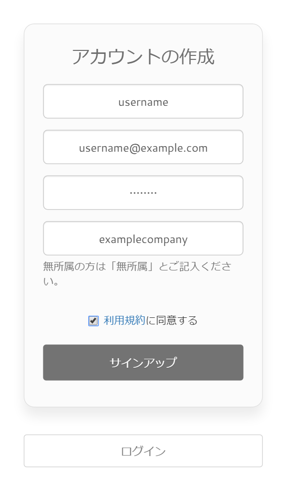
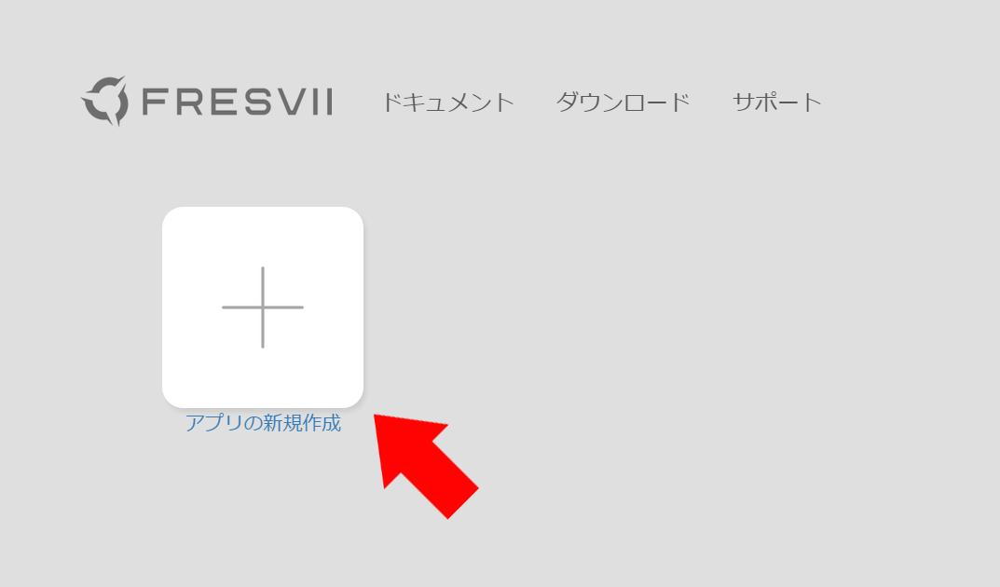
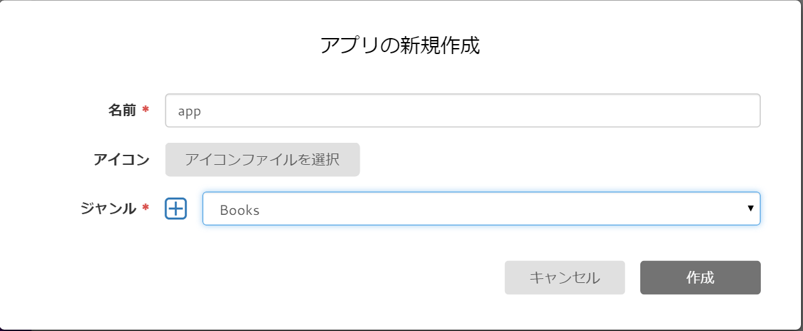
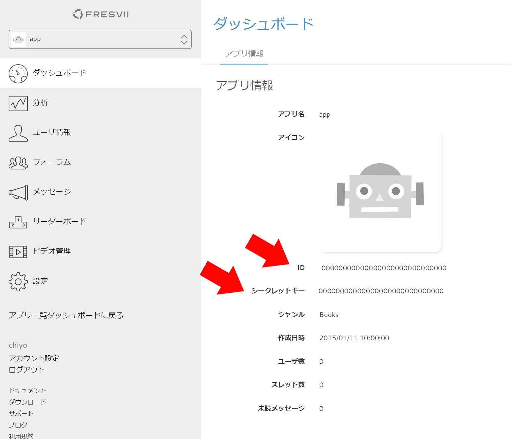

# Webコンソールでアプリ登録

----------

AppSteroid SDKを利用するための事前準備として、[Fresviiサイト](https://fresvii.com/)でのアカウント作成、ログイン、アプリ登録までの方法を説明します。
## [Fresviiサイト](https://fresvii.com/)へのアクセス
1. 任意のWebブラウザから、[Fresviiサイト](https://fresvii.com/) に接続します。
サインアップを選択します。

## アカウントの作成
１. ユーザー名、e-mailアドレス、パスワード、所属を記入しログインを行います。

## 新規アプリケーションの作成
1. トップページから"アプリの新規作成"を選択します。

2. アプリケーション名、アイコン、ジャンルを記入し作成を選択します。

3. 作成が成功した場合、ダッシュボードが表示されます。
ここで表示される、ID及びシークレットキーは、[GetStarted](3_GetStarted.md)にて使用します。

4.以上でWeb上での初期設定は完了です。
ユーザーの情報はダッシュボード上から随時確認することができます。