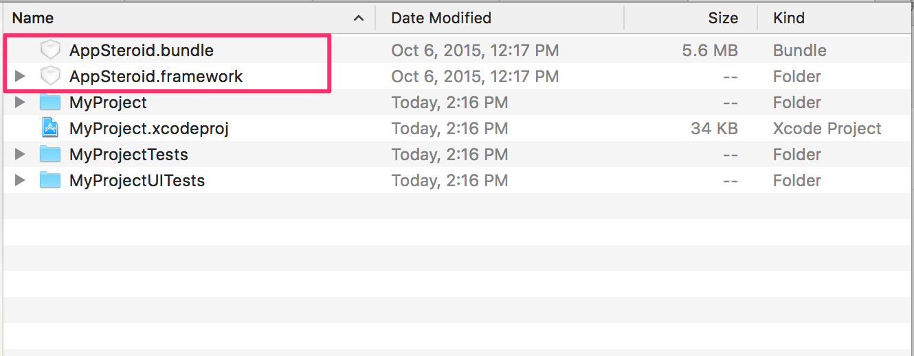

# AppSteroid for iOS Getting Started

last update at 2015/12/10

---

- [導入](#Installation)
- [初期設定](#Initialization)
- [AppSteroidGUIの表示](#ShowGUI)
- [SDKのアップデート方法](#HowToUpdate)

---

AppSteroid for iOSはiOS7.0以上をサポートしています。  
導入前にWebコンソールでアプリ登録が終わっていることを確認してください。[アプリ登録方法](./2_AppRegistration.md)

## <a name="Installation"> 導入 </a>

1. Frameworkのダウンロード

Fresviiの[ウェブサイト](https://fresvii.com/downloads)からiOS SDK用のフレームワークをダウンロードしてください。

2. ダウンロードしたFrameworkとBundleをプロジェクトファイルに移動させてください。


3. Frameworkの追加
`Build Phases`の`Link Binary With Libraries`に`AppSteroid.framework`を追加してください。(既に追加されている場合は無視してください。)  

また以下のFrameworksも同様に追加してください。  

```
Accounts.framework
AdSupport.framework
AVFoundation.framework
CoreData.framework
CoreMedia.framework
MessageUI.framework
Social.framework
SystemConfiguration.framework
```

4. Bundleの追加
`Build Phases`の`Copy Bundle Resourves`に`AppSteroid.bundle`を追加してください。(既に追加されている場合は無視してください。)


5. Build Settings
`Other Linker Flags`に`-ObjC`を記述してください。


## <a name="Initialization"> 初期設定 </a>

AppSteroidの利用を開始するためには、アプリケーションが起動するタイミングで初期設定をおこなう必要があります。
`AppDelegate.m`の`application:didFinishLaunchingWithOptions:`に[AppSteroid](7_Spec.md#AppSteroid)の[startWithAppIdentifier:secretToken:development:](7_Spec.md#AppSteroid.startWithAppIdentifiersecretTokendevelopment)を記述してください。
このAPIはアプリIDとシークレットトークンを引数に渡す必要があります。アプリIDとシークレットトークンの取得方法は[アプリ登録方法](./2_AppRegistration.md)でご確認ください。

```obj-c
#import <AppSteroid/AppSteroid.h>

    …
    …

- (BOOL)application:(UIApplication *)application
didFinishLaunchingWithOptions:(NSDictionary *)launchOptions
{
    // Start AppSteroid.
    NSString *appId = @"xxxxxxxxxxxxxxxxxxxxxxx";
    NSString *secretToken = @"yyyyyyyyyyyyyyyyyyyyyyyy";
 #ifdef DEBUG
    BOOL development = YES;
 #else
    BOOL development = NO;
 #endif
    [AppSteroid startWithAppIdentifier:appId
                           secretToken:secretToken
                           development:development];

	…
	…
	…

	return YES;
}
```

## <a name="ShowGUI"> AppSteroidGUIの表示 </a>

アプリを起動すると自動でユーザーが作成されます。そのためユーザー作成やログインといった実装は不要です。  
以下の様なコードを記述するだけでAppSteroidが提供するGUIをすぐに表示することができます。

```obj-c
- (IBAction)pushedTabButton:(id)sender
{
    [FASTabBarController presentTabBarControllerWithTarget:self
                                                  animated:YES];
}
```

## <a name="HowToUpdate"> SDKのアップデート方法 </a>

特に特別な操作は必要ありません。  
古いSDKを削除して新しいSDKを再度インストールしてください。
