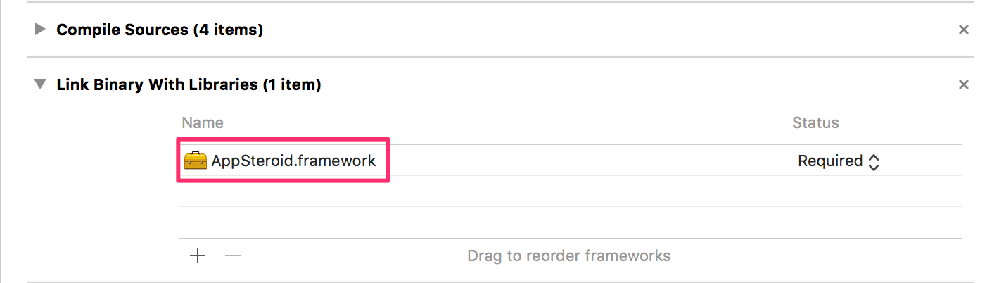
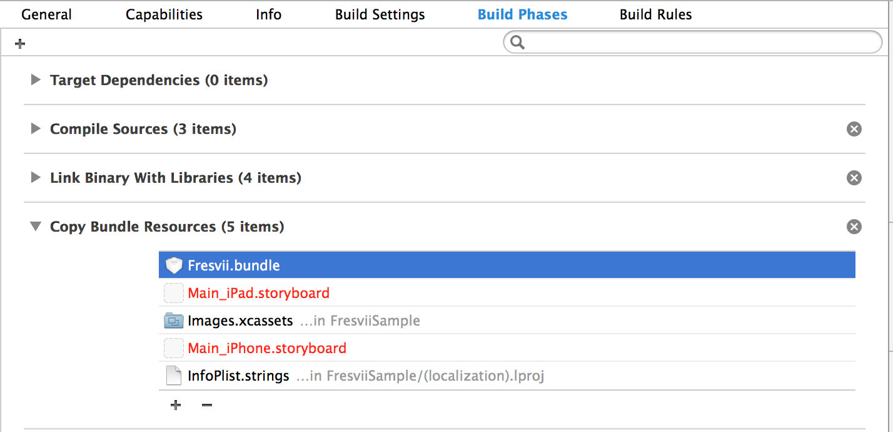
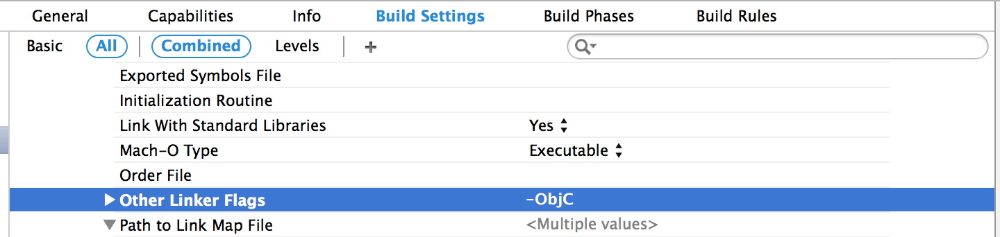

# AppSteroid for iOS Getting Started

last update at 2015/5/26

---

- [導入](#Installation)
- [初期設定](#Initialization)
- [ユーザー作成からログインまで](#SignUp&Login)
- [簡単にタブ画面を表示する](#ShowTab)
- [ログインからAppSteroidGUIの表示まで](#Login&ShowTab)

---

AppSteroid for iOSはiOS7.0以上をサポートしています。  
導入前にWebコンソールでアプリ登録が終わっていることを確認してください。[アプリ登録方法](./2_Webコンソールでアプリ登録.md)

## <a name="Installation"> 導入 </a>

1. Frameworkのダウンロード

Fresviiのウェブサイトから以下のどちらかのフレームワークをダウンロードしてください。

```
- ボイスチャット無しのバージョン
	- appsteroid-ios-X.X.X.zip
- ボイスチャット機能ありのバージョン
	- appsteroid-ios-with-voicechat-X.X.X.zip
```
___ボイスチャットの利用にはこちらの`導入`と合わせて[GetStarted-VoiceChat.md](GetStarted/GetStarted-VoiceChat.md#HowToUseAPI)も参照してください。___


2. Frameworkの追加
`Build Phases`の`Link Binary With Libraries`に`AppSteroid.framework`以下を追加してください。


3. Bundleの追加
`Build Phases`の`Copy Bundle Resourves`に`AppSteroid.bundle`を追加してください。


4. Build Settings
`Other Linker Flags`に`-ObjC`を記述してください。


## <a name="Initialization"> 初期設定 </a>

AppSteroidの利用を開始するためには、アプリケーションが起動するタイミングで初期設定をおこなう必要があります。
`AppDelegate.m`の`application:didFinishLaunchingWithOptions:`に[AppSteroid](AppSteroidSpec.md#AppSteroid)の[startWithAppIdentifier:secretToken:development:](AppSteroidSpec.md#AppSteroid.startWithAppIdentifiersecretTokendevelopment)を記述してください。
このAPIはアプリIDとシークレットトークンを引数に渡す必要があります。アプリIDとシークレットトークンの取得方法は[アプリ登録方法](./2_Webコンソールでアプリ登録.md)でご確認ください。

```
#import <AppSteroid/AppSteroid.h>

    …
    …

- (BOOL)application:(UIApplication *)application
didFinishLaunchingWithOptions:(NSDictionary *)launchOptions
{
    // Start AppSteroid.
    NSString *appId = @"xxxxxxxxxxxxxxxxxxxxxxx";
    NSString *secretToken = @"yyyyyyyyyyyyyyyyyyyyyyyy";
 #ifdef DEBUG
    BOOL development = YES;
 #else
    BOOL development = NO;
 #endif
    [AppSteroid startWithAppIdentifier:appId
                           secretToken:secretToken
                           development:development];

	…
	…
	…

	return YES;
}
```

## <a name="SignUp&Login"> ユーザー作成からログインまで </a>

```obj-c
#import <AppSteroid/FASAccount.h>

- (IBAction)pushedAppSteroidButton:(id)sender
{
	FASLoginUser *loginUser = [FASAccount currentLoggedInUser];	
	// サインアップ済みのユーザーがいない場合
    if (!loginUser || !loginUser.isSignedUp)
    {
		[FASAccount signUpUserCompletion:^(FASLoginUser *loginUser, NSError *error)
		{
			if (error)
			{
				NSLog(@"%@", error);
				return;
			}
		}];
	}
}
```

## <a name="ShowTab"> 簡単にタブ画面を表示する </a>

`Forum`,`Leaderboard`,`Messages`,`Profile`の順番にタブビューを表示します。
表示させたいビューを指定したりする場合は、下の`タブに表示するビューを指定する`を参照してください。

```obj-c
#import <AppSteroid/FASTabBarController.h>

- (IBAction)pushedTabButton:(id)sender
{
    [FASTabBarController presentTabBarControllerWithTarget:self
                                                  animated:YES];
}
```

## <a name="Login&ShowTab"> ログインからAppSteroidGUIの表示まで </a>

[ログインからAppSteroidGUIの表示まで](./5_ログインからAppSteroidGUIの表示まで.md)を参照してください。
