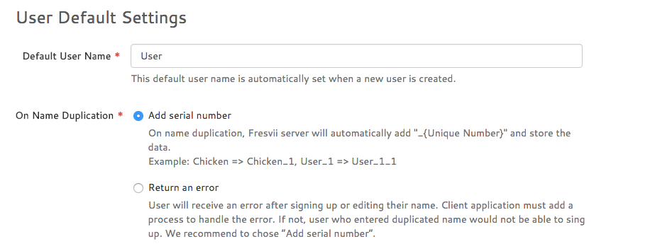

#　ユーザー名重複時の挙動に関して

サインアップや名前変更を行う際に、ユーザー名が重複した時の挙動を変更することができます。  
1. 重複した際に自動で末尾に番号を付ける  
2. 重複した際にAPIでエラーを返却する  



対象となるAPIは以下です。  
- [FASUser#signUpUserWithCompletion:](./Specs/Spec-User.md#FASAccount.signUpUserWithCompletion)  
- [FASUser#signUpUserWithName:completion:](./Specs/Spec-User.md#FASAccount.signUpUserWithNamecompletion)  
- [FASUser#signUpUserWithName:description:profileImage:completion:](./Specs/Spec-User.md#FASAccount.signUpUserWithNamedescriptionprofileImagecompletion)  
- [FASUser#saveWithCompletion:](./Specs/Spec-User.md#FASLoginUser.saveWithCompletion)

### 1を選択した場合
ユーザー名が重複してもAPIはエラーを返却せずに、自動で名前の末尾に番号を付与します。  
例えば`Chicken`というユーザー名が既に利用されてた場合、同じ名前でサインアップまたは名前変更を行おうとした場合、`Chicken_1`という名前で自動的に登録されるようになります。

### 2を選択した場合
ユーザー名が重複した場合はAPIで下記のようなエラーがNSErrorオブジェクトに格納されて返却されます。

```
Error Domain=com.fresvii.fresvii-sdk-ios.error Code=2002 "The operation couldn’t be completed. (com.fresvii.fresvii-sdk-ios.error error 2002.)" UserInfo=0x7fe220d1c3e0 {code=0402, message=Validation failed: Name has already been taken, params=<CFBasicHash 0x7fe220dadd40 [0x11469e180]>{type = immutable dict, count = 3,
entries =>
 0 : <CFString 0x7fe220d8bac0 [0x11469e180]>{contents = "name_uniqueness"} = <CFString 0x7fe220d8baf0 [0x11469e180]>{contents = "true"}
 1 : <CFString 0x7fe220d3c370 [0x11469e180]>{contents = "text/plain"} = <CFString 0x7fe220d1c390 [0x11469e180]>{contents = "[""]"}
 2 : <CFString 0x7fe220d8baa0 [0x11469e180]>{contents = "description"} = <CFString 0x7fe220d8baa0 [0x11469e180]>{contents = "description"}
}
, error=ArgumentError}
```

このエラーをハンドリングすることでユーザー名重複の理由でサインアップ出来ないなど情報をユーザーに伝えることができます。  
例えば以下のようにハンドリングすることができます。

```obj-c
- (void)_showErrorAlert:(NSError *)error
{
    NSDictionary *userInfo = error.userInfo;
    if ([userInfo[@"code"] isEqualToString:@"0402"])
    {
        [[[UIAlertView alloc] initWithTitle:@"Error"
                                    message:@"Your user name is duplicated. Please use other user name."
                                   delegate:nil
                          cancelButtonTitle:@"OK"
                          otherButtonTitles:nil] show];
    }
}
```