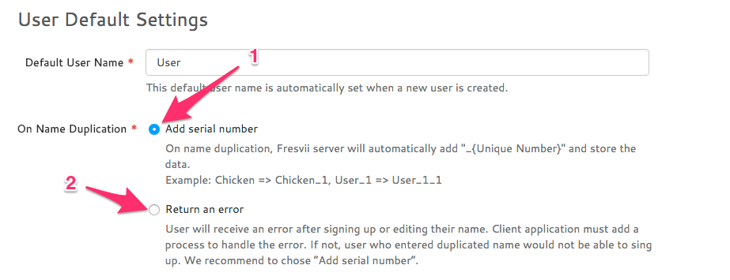

#　ユーザー名重複時の挙動に関して

サインアップや名前変更を行う際に、ユーザー名が重複した時の挙動を変更することができます。  
1. 重複した際に自動で末尾に番号を付ける  
2. 重複した際にAPIでエラーを返却する  



対象となるAPIは以下です。  
- [FASUser#signUpUserWithCompletion:](./Specs/Spec-User.md#FASAccount.signUpUserWithCompletion)  
- [FASUser#signUpUserWithName:completion:](./Specs/Spec-User.md#FASAccount.signUpUserWithNamecompletion)  
- [FASUser#signUpUserWithName:description:profileImage:completion:](./Specs/Spec-User.md#FASAccount.signUpUserWithNamedescriptionprofileImagecompletion)  
- [FASUser#saveWithCompletion:](./Specs/Spec-User.md#FASLoginUser.saveWithCompletion)

### 1を選択した場合
ユーザー名が重複してもAPIはエラーを返却せずに、自動で名前の末尾に番号を付与します。  
例えば`Chicken`というユーザー名が既に利用されてた場合、同じ名前でサインアップまたは名前変更を行おうとした場合、`Chicken_1`という名前で自動的に登録されるようになります。

### 2を選択した場合
ユーザー名が重複した場合はAPIで下記のようなエラーを返却するようになります。

```

```

このエラーをハンドリングすることでユーザー名重複の理由でサインアップ出来ないなど情報をユーザーに伝えることができます。

```

```