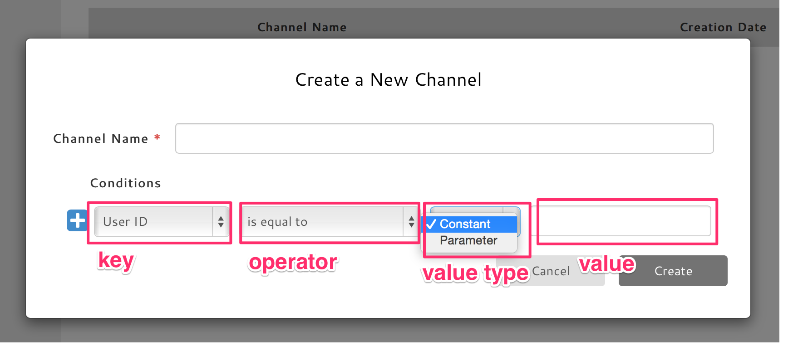
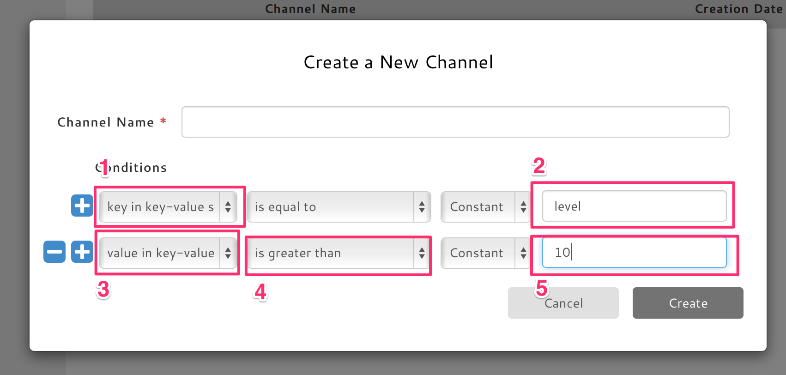
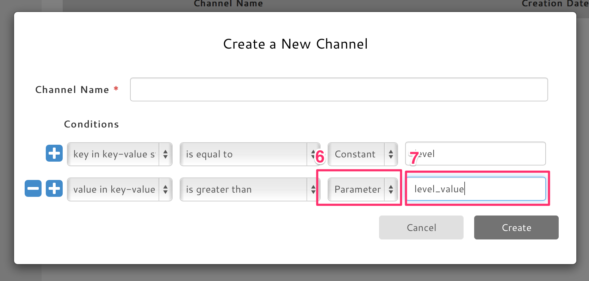

# カスタムメッセージとチャンネルについて

## はじめに
チャンネルはカスタムメッセージの送信宛先として使用します。
クライアントからのカスタムメッセージはアプリで一意な名前を持ったチャンネルに対して送信します。メッセージはチャンネルによって定義されたユーザに対してブロードキャストされ、そのユーザはクエリにより送信時に動的に決定されます。

## チャンネルの定義
デベロッパはアプリからカスタムメッセージを送信する為に事前にWebコンソール上でチャンネルを定義しておく必要があります。(チャンネルの定義はWebコンソール Settings > Channels で行います。)

チャンネル定義時の条件として キー、演算子、値を指定します。
キーおよび演算子はコンボボックスの中から選択します。
演算子は選択したキーによって選択肢が異なります。
値は種類を「固定値」または「送信時」から選択する必要があります。
固定値を選択した場合、クエリの値として常に入力した値が使用されます。
送信時を選択した場合、入力した値はカスタムメッセージ送信時に指定するチャンネルパラメータの変数名として使用されます。



キーバリューストアの値を元にユーザの絞り込みを行えば、工夫次第で柔軟なユーザの絞り込みが可能です。

#### 定義例

ユーザのキーバリューストアを使い以下のようにユーザのレベルを管理している前提

- key: level
- value: level value

この時、「レベル 10 以上のユーザ」というチャンネルを定義してみます。



まずは キーバリューストアの "level" を対象とするよう指定します。

1. 絞り込みkeyに "key" を選択
2. 値に "level" を指定

これで key = level を指定しました。

次に その値が 10 以上のものとなるよう指定します。

3. 絞り込みkeyに "value" を選択
4. 演算子に "is grater than" を選択
5. 値に "10" を指定

これで key = level && value >= 10 を保持するユーザを対象とするよう指定できました。


更に応用して、「レベル X 以上のユーザ」として、X はメッセージ送信時に決定できるよう定義しなおしてみます。



先ほどとは異なり、値指定の際に 値の種類を "送信時" にして、その値を指定するための変数名を入力します。

6. 値の種類に "送信時" を選択
7. 値に "level_value" を指定

これで level_value の部分を実行時に決めるようチャンネルを定義できました。

実際のメッセージ送信はカスタムメッセージAPIの channelParams に値を指定する事で行います。
channelParamsには以下のように値を指定します。

```
// 実際のコードはそれぞのSDKに従ってください。
{"level_value" : 20}
```

これで実行時にレベル 20 以上のユーザを対象にメッセージを送るようにチャンネルを定義する事ができました。

値に固定値を使うか、送信時を使うかは定義するチャンネルの性質によります。
上手く使う事で効率良く最小限のチャンネル数で定義する事も可能です。
また固定値を使うことでよりシンプルさを保つ事が可能です。


他にも・・・

- ユーザのゲーム内ロケーションをキーバリューに保存し、実行時にユーザのロケーションをパラメータとして送信する事でプレイヤーの近くにいるユーザにのみ
- プレイヤーの作成日をパラメータとして、作成日が近いユーザのみ

などアイデア次第でオリジナルのチャンネルを定義してゲーム内で利用可能です。


## カスタムメッセージ送信

カスタムメッセージ送信APIを使用して定義済みのチャンネルに対し、任意のメッセージを送信します。
条件式に「固定値」のみで定義されたチャンネルにはチャンネルパラメータ無しでメッセージを送信できますが、「送信時」で定義されたチャンネルには必ずチャンネルパラメータを指定する必要があります。

メッセージは任意のアクション名を指定して送信します。受信側ではイベントを介して指定されたアクションを監視している処理が呼び出されます。

カスタムメッセージの受信側では resource: "custom_message", action: "created" としてイベントが発生します。
このイベントを監視(observe)する事でメッセージ受信時の処理を行う事が可能です。
詳しくはそれぞれのSDKのドキュメント参照してください。


カスタムメッセージは単にPushメッセージとしても利用できます。
その際、プラットフォームに応じたプッシュメッセージとして以下のようなパラメータを指定する事が可能です。
必要に応じて利用してくだささい。

* subject: プッシュ受信時にバナー表示を行うか。行う場合のテキスト。
* sound: プッシュ受信時にサウンドを鳴らすか。鳴らす場合はそのサウンドファイルの名前。
* apns_enabled: iOS端末にメッセージを届けるかどうか
* gcm_enabled: Android端末にメッセージを届けるかどうか
