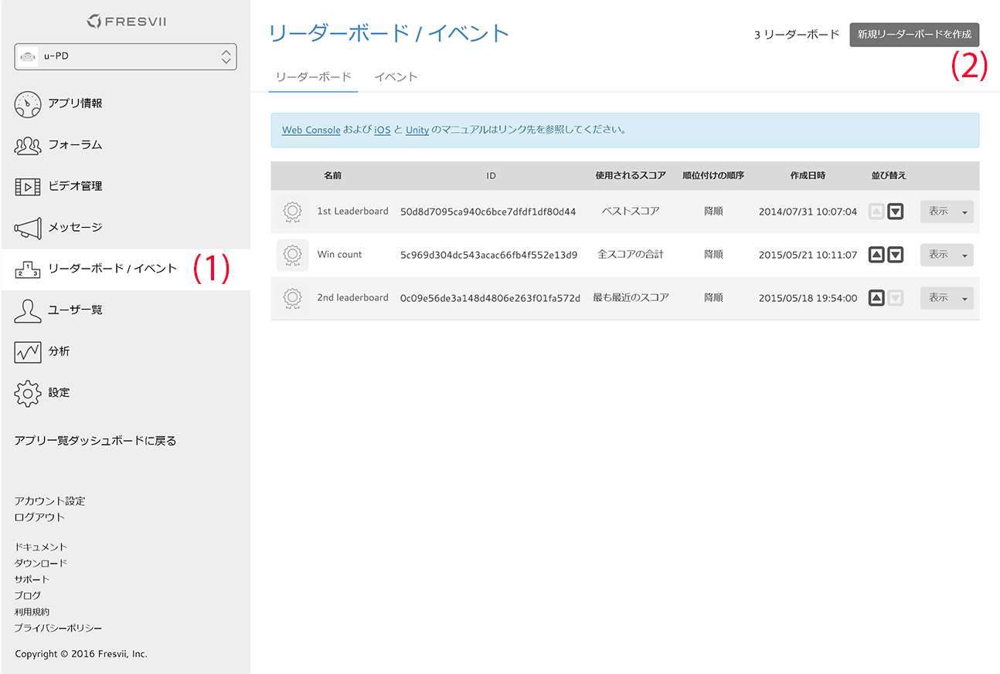
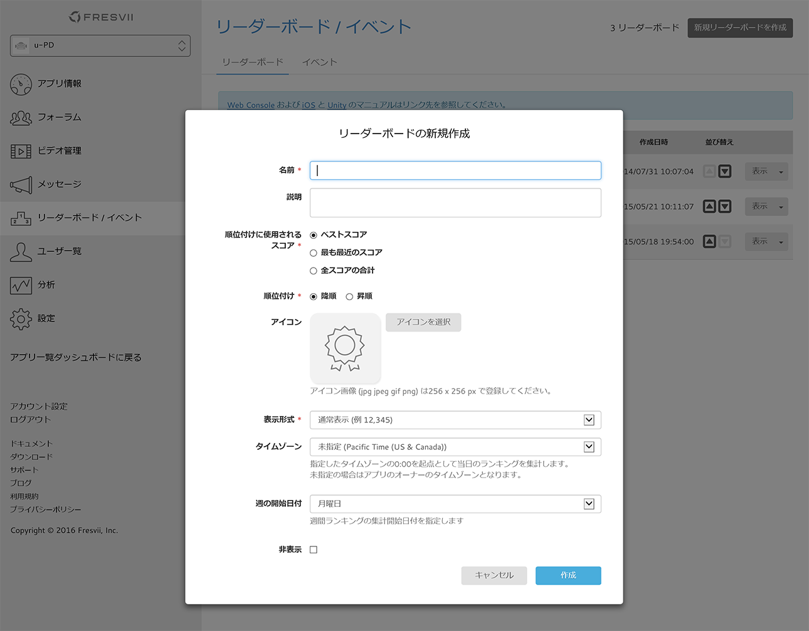
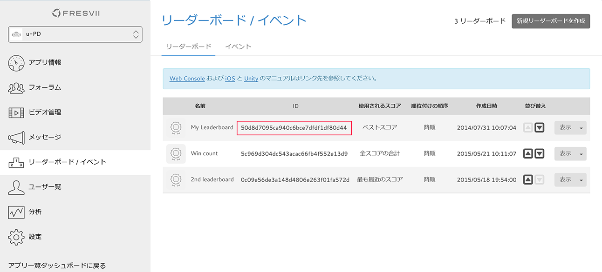

# Getting Started - Leaderboard

last update at 2016/2/1

---

- [リーダーボードの概要](#AboutLeaderboard)
- [リーダーボードを利用するための準備](#PrepareForLeaderboard)
- [リーダーボードAPIの利用](#HowToUseAPI)
	- [スコアの登録](#SubmitScore)

---

## <a name="AboutLeaderboard"> リーダーボードの概要 </a>
AppSteroid では、リーダーボード機能により、プレイヤーのスコア、ランキングを管理できます。  
リーダーボードでは、スコア値を整数値として保持します。
リーダーボードのスコア値の表示形式としては「通常表示」「時間表示」「ミリ秒時間表示」の３つが選択可能です。
選択した表示形式で AppSteroid の GUI にてスコア値を表示します。

|表示形式|内容|例|
|-|-|-|
|通常表示|スコア値をそのまま表示します。得点やクリア回数などをランキングする場合に利用します。|例）スコア値 = 12345 → 表示 12,345|
|時間表示|スコア値を秒単位として解釈し、時間表示します。|例）スコア値 = 12345 → 表示 3: 25:45|
|ミリ秒時間表示|スコア値をミリ秒単位として解釈し、時間表示します。小数点以下の桁数として、ミリ秒表示桁数１～３を選択可能です。設定した桁数よりも小さな数字は表示時に切り捨てられます。|例）スコア値 = 12345 , 桁数 2 → 表示 12.34|

## <a name="PrepareForLeaderboard"> リーダーボードを利用するための準備 </a>

リーダーボード作成画面にて、「新規リーダーボードを作成」します。任意の名前をつけて、リーダーボードの設定をしてください。





作成後、**リーダーボードのID**を確認して下さい。



## <a name="HowToUseAPI"> リーダーボードAPIの利用 </a>

### <a name="SubmitScore"> スコアの登録 </a>

[FASScore](../Specs/Spec-Leaderboard.md#FASScore)の[submitScoreWithLeaderboardId:value:completion:](../Specs/Spec-Leaderboard.md#FASScore.submitScoreWithLeaderboardIdvaluecompletion)を利用して対象のリーダーボードに対してスコアを登録します。

Sample
0〜1000のランダムな値をスコアとして登録する

```
#import <AppSteroid/FASScore.h>

	…
	…

- (IBAction)pushedSubmitButton:(id)sender
{
    NSString *leaderboardId = @"xxxxxxxxxxxxxxxxxx";
    int score = arc4random() % 1000;
    [FASScore submitScoreWithLeaderboardId:leaderboardId
                                     value:score
                                completion:nil];
}
```
