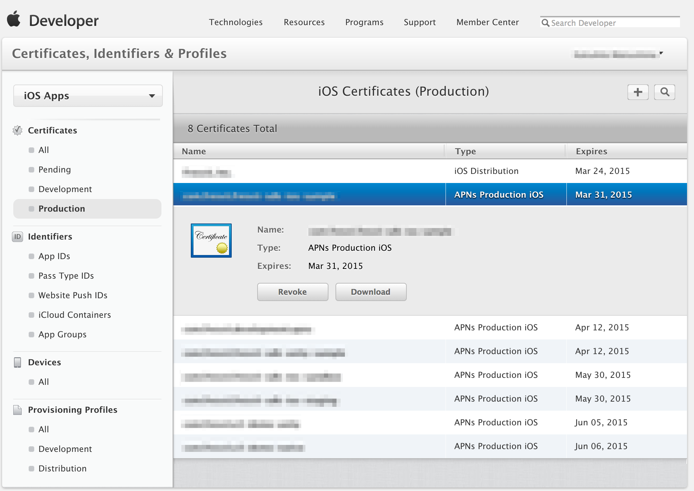
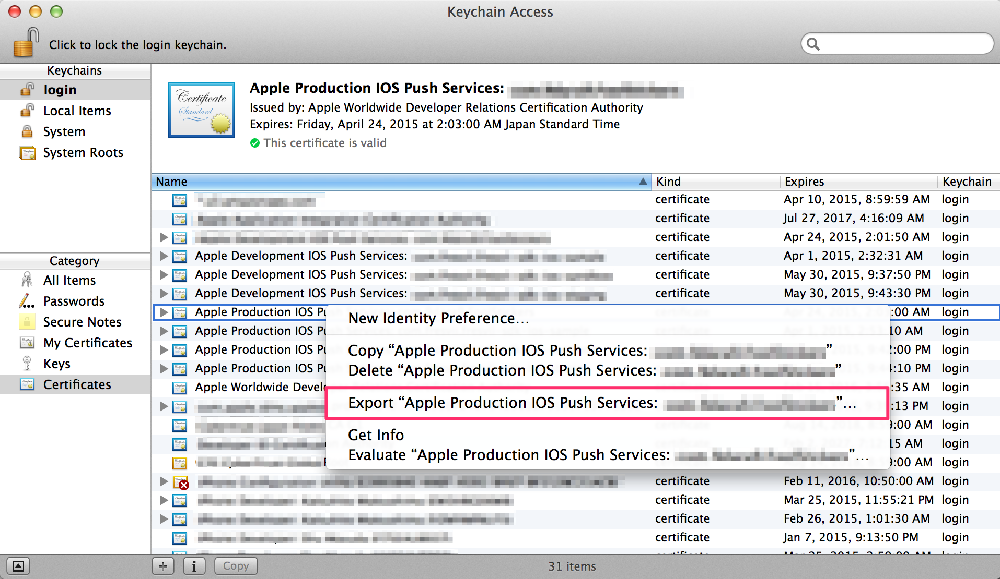
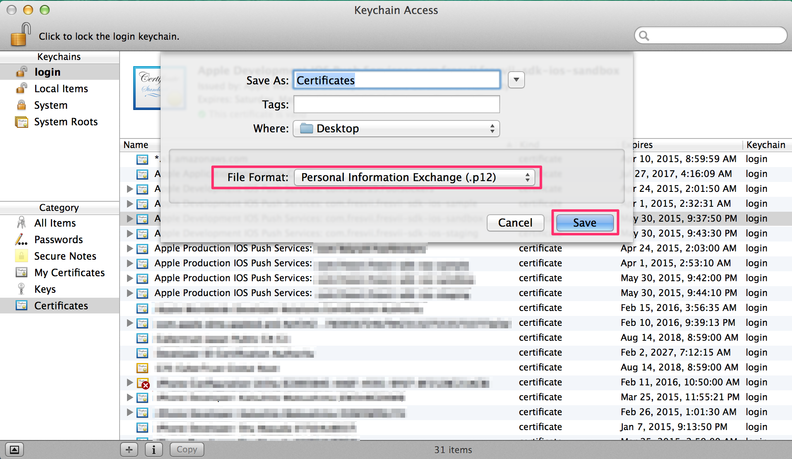
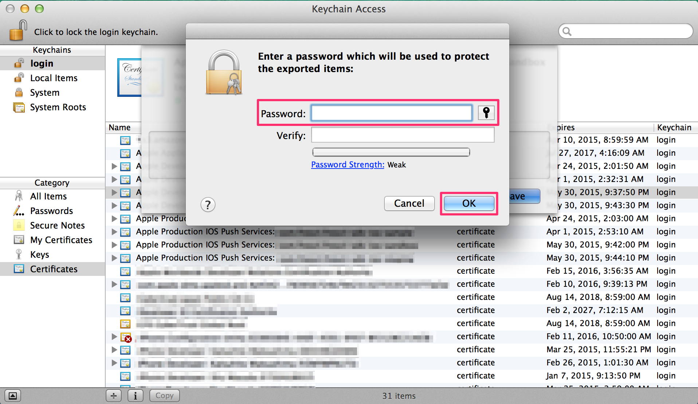
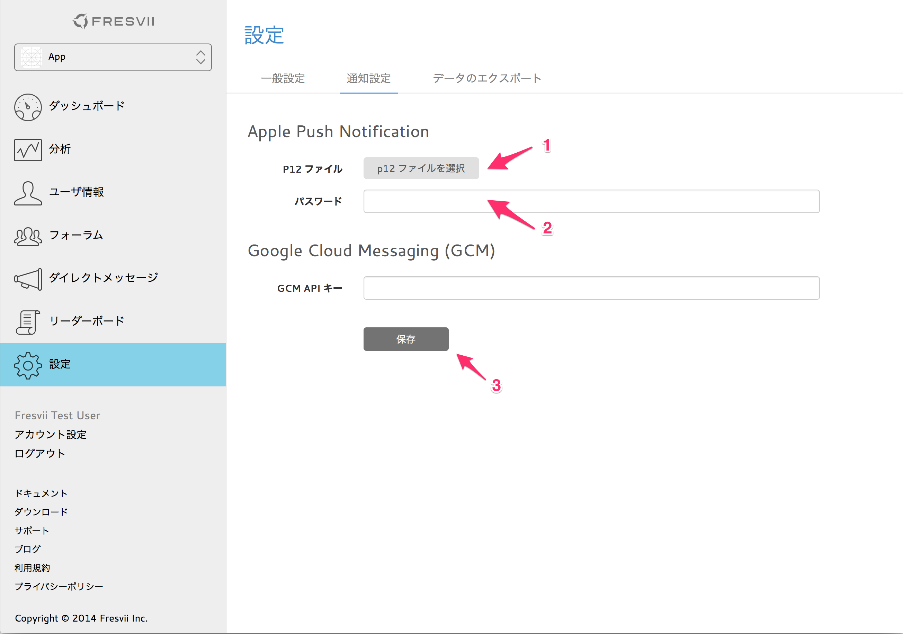
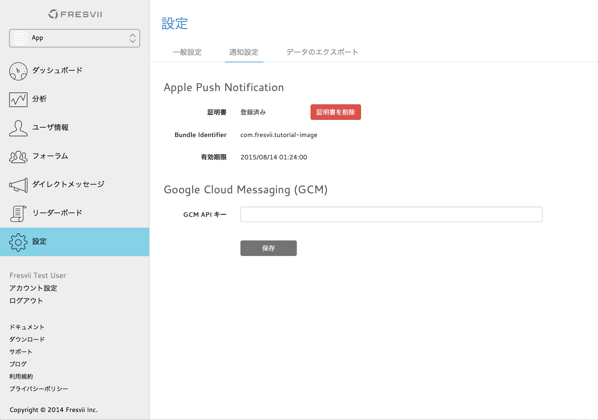

# Getting Started - Push Notification

last update at 2014/10/7

---

- [Push Notificationの設定](#HowToSetupPushNotification)
	- [プッシュ通知用証明書の作成](#CreateCertificates)
	- [プッシュ通知用証明書の登録](#RegisterCertificates)
	- [p12ファイルの作成](#CreateFiles)
	- [p12ファイルのアップロード](#UploadFiles)
	- [プッシュ通知を利用するための実装](#ImplementCodes)
- [プッシュ通知の種類](#EventList)
- [プッシュ通知のイベント監視](#ObserveEvent)
- [特定のユーザーに対してプッシュ通知を送信](#CustomMessage)
	- [チャンネルの設定](#SettingChannel)
	- [ストレージの利用](#UseKVS)
    - [メッセージの送信](#SendMessage)
- [プッシュ通知から自動的にAppSteroidのビューを表示する設定](#DisplayFresviiGUI)

---

## <a name="HowToSetupPushNotification"> Push Notificationの設定 </a>

### <a name="CreateCertificates"> プッシュ通知用証明書の作成 </a>

[APNSCertificateTutorial](https://github.com/fresvii/appsteroid-documents/blob/master/ja/APNSCertificateTutorial.md)を参照して証明書の作成を行ってください。

### <a name="RegisterCertificates"> プッシュ通知用証明書の登録 </a>

iOS Dev Centerで作成したプッシュ通知用の証明書をダウンロードします。

ダウンロードした証明書をKeyChainに登録します。KeyChainには以下の名前で登録されています。
* 開発用 : Apple Development IOS Push Services: Your.Bundle.ID
* 製品用 : Apple Production IOS Push Services: Your.Bundle.ID

### <a name="CreateFiles"> p12ファイルの作成 </a>

KeyChainを開き、先ほど登録した証明書を右クリックして"Export"を選択します。

ファイル名を入力し、ファイルフォーマットが"Personal Information Exchange(.p12)"となっていることを確認して"Save"を押します。

パスワードを入力してp12ファイルを作成します。


### <a name="UploadFiles"> p12ファイルのアップロード </a>

[Fresvii](https://fresvii.com/)にログインして、`設定->通知設定`より作成したp12ファイルをアップロードします。(1)
p12ファイルを書き出す際にパスワードを設定した場合は`パスワード`フォームにパスワードを入力してください。(2)
設定が完了したら`保存`ボタンを押します。(3)

アップロードが完了すると以下の画面になります。


### <a name="ImplementCodes"> プッシュ通知を利用するための実装 </a>

プッシュ通知を利用するために`AppDelegate.h`に以下のような実装が必要になります。

```
#import <AppSteroid/FASNotification.h>

	…
	…

- (BOOL)application:(UIApplication *)application
didFinishLaunchingWithOptions:(NSDictionary *)launchOptions
{
	…
	…

   [application registerForRemoteNotificationTypes:(UIRemoteNotificationTypeBadge|
                                                     UIRemoteNotificationTypeSound|
                                                     UIRemoteNotificationTypeAlert)];

    return YES;
}

#pragma mark - Remote Push Notification methods.

- (void)application:(UIApplication *)application
didRegisterForRemoteNotificationsWithDeviceToken:(NSData *)deviceToken
{
    [FASNotification addDeviceToken:deviceToken completion:nil];
}

- (void)application:(UIApplication*)application
didFailToRegisterForRemoteNotificationsWithError:(NSError *)error
{
    LOG(@"Errorinregistration:%@",error);
}
```

## <a name="EventList"> プッシュ通知の種類 </a>

[Push通知のイベントリスト](https://github.com/fresvii/appsteroid-documents/blob/master/ja/EventList.md)を参照してください。

## <a name="ObserveEvent"> プッシュ通知のイベント監視 </a>

AppSteroid関連のプッシュ通知のイベントを監視するには、`AppDelegate.h`に以下のような実装が必要になります。


```
#import <AppSteroid/FASNotification.h>

	…
	…

- (BOOL)application:(UIApplication *)application
didFinishLaunchingWithOptions:(NSDictionary *)launchOptions
{
	…
	…

    [FASNotification handleDidFinishLaunchingWithOptions:launchOptions];

    return YES;
}

- (void)application:(UIApplication *)application
didReceiveRemoteNotification:(NSDictionary *)userInfo
{
    [FASNotification handleDidReceiveRemoteNotification:userInfo];
}

- (void)application:(UIApplication *)application
didReceiveRemoteNotification:(NSDictionary *)userInfo
fetchCompletionHandler:(void (^)(UIBackgroundFetchResult))completionHandler
{
    completionHandler(UIBackgroundFetchResultNewData);
    [FASNotification handleDidReceiveRemoteNotification:userInfo];
}
```

上記の設定が完了している場合、[FASEvent](../Specs/Spec-Notification.md#FASEvent)を利用してイベントを監視することが可能です。
以下のサンプルコードは、フレンドリクエストのイベントを監視するためのコードです。

Sample

```
#import <AppSteroid/FASEvent.h>

@implementation ViewController
{
    FASObserver *_observer;
}

- (void)viewWillAppear:(BOOL)animated
{
    [super viewWillAppear:animated];

    [self _observeEvent];
}

- (void)viewWillDisappear:(BOOL)animated
{
    [super viewWillDisappear:animated];

    [self _unobserveEvent];
}

- (void)_observeEvent
{
    _observer = [FASEvent observeEventWithPath:@"user/friendship/request"
                                        action:@"created"
                                  eventHandler:^(NSDictionary *params)
    {
        // paramsの中身には通知内容の詳細が格納されています。
    }];
}

- (void)_unobserveEvent
{
    [FASEvent unobserve:_observer];
}
```

## <a name="CustomMessage"> 特定のユーザーに対してプッシュ通知を送信 </a>
** [こちらの資料](../ChannelTutorial.md)も合わせてご覧ください。 **  
[FASCustomMessage](../Specs/Spec-Notification.md#FASCustomMessage)を利用します。
設定したチャンネルに該当するユーザーに対して通知を行います。チャンネルの設定はFresviiのウェブコンソールから行う必要があります。

### <a name="SettingChannel"> チャンネルの設定 </a>

チャンネルの設定はFresviiのウェブコンソールから行います。
サンプルとして[Key-Value Storage](../Specs/Spec-Storage.md#FASStorage)を利用したユーザーの絞り込み方法を示します。

まず始めにコンソールからチャンネルを設定します。
`level`というキーに対して`bind_level`という変数でユーザーの絞り込みを行う設定です。

```

```

### <a name="UseKVS"> ストレージの利用 </a>

次に`level`というキーに対して`10`という値をストレージに保存します。

Sample

```
#import <AppSteroid/FASStorage.h>

	…
	…

- (IBAction)pushedAddLevelButton:(id)sender
{
    NSDictionary *data = @{@"level" : @"10"};
    [FASStorage addData:data
             completion:^(NSError *error)
    {
        if (error)
        {
            // エラー
            return;
        }

        // 成功
    }];
}
```

### <a name="SendMessage"> メッセージの送信 </a>

`level == 10`のユーザーを絞り込みメッセージを送信します。

Sample

```
#import <AppSteroid/FASCustomMessage.h>

	…
	…

- (IBAction)pushedSendMessageToSameLevelUserButton:(id)sender
{
    // ウェブコンソールで設定したチャンネル名
    NSString *channelName = @"level";
    // ウェブコンソールで設定した変数名とその値
    NSDictionary *channelParams = @{@"bind_level" : @"10"};

    [FASCustomMessage sendMessageWithChannelName:channelName
                                          action:@"created"
                                   channelParams:channelParams
                                          params:nil
                                         subject:@"subject"
                                           sound:nil
                                     apnsEnabled:YES
                                      gcmEnabled:YES
                                      completion:^(FASCustomMessage *message, NSError *error)
    {
        if (error)
        {
            // エラー
            return;
        }

        // 成功
    }];
}
```

## <a name="DisplayFresviiGUI"> プッシュ通知から自動的にAppSteroidのビューを表示する設定 </a>

プッシュ通知からアプリケーションを起動した際、通知対象のAppSteroidが提供するGUIを自動的に表示します。
例えばフォーラムでコメント書き込みの通知を受け取った際に対象のスレッドに遷移する等と言った機能です。
この機能はデフォルトで利用する状態になっていますが、もしゲーム中などで対象のGUIを表示したくない等と言った場合には設定が必要になります。

```
// プッシュ通知から対象のGUIを自動的に表示します。
[FASNotification allowsToHandlePushNotification:YES];

// プッシュ通知をタップしてもアプリケーションを起動するのみです。
[FASNotification allowsToHandlePushNotification:NO];
```
