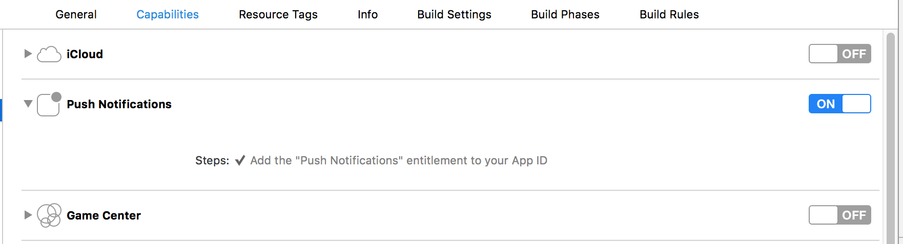

# Getting Started - Push Notification

last update at 2015/12/19

---

- [Push通知の設定](#HowToSetupPushNotification)
- [プッシュ通知を利用するための実装](#ImplementCodes)
- [プッシュ通知の種類](#EventList)
- [プッシュ通知のイベント監視](#ObserveEvent)
- [特定のユーザーに対してプッシュ通知を送信](#CustomMessage)
	- [チャンネルの設定](#SettingChannel)
	- [ストレージの利用](#UseKVS)
    - [メッセージの送信](#SendMessage)
- [プッシュ通知から自動的にAppSteroidのビューを表示する設定](#DisplayFresviiGUI)

---

## <a name="HowToSetupPushNotification"> Push Notificationの設定 </a>
プッシュ通知の設定方法は[こちら](https://github.com/fresvii/appsteroid-documents/blob/master/ja/APNSCertificateTutorial.md)を参照してください。

## <a name="ImplementCodes"> プッシュ通知を利用するための実装 </a>

Capabilities->Push NotificationsをONにしてください。


プッシュ通知を利用するために`AppDelegate.h`に以下のような実装が必要になります。

```
#import <AppSteroid/FASNotification.h>

	…
	…

- (BOOL)application:(UIApplication *)application
didFinishLaunchingWithOptions:(NSDictionary *)launchOptions
{
	…
	…

    float iOSVersion = [[[UIDevice currentDevice] systemVersion] floatValue];
    if(iOSVersion >= 8.0)
    {
        UIUserNotificationSettings *settings = [UIUserNotificationSettings settingsForTypes:(UIRemoteNotificationTypeBadge
                                                                                             |UIRemoteNotificationTypeSound
                                                                                             |UIRemoteNotificationTypeAlert) categories:nil];
        [application registerUserNotificationSettings:settings];
    }
    else
    {
        UIRemoteNotificationType types = UIRemoteNotificationTypeBadge | UIRemoteNotificationTypeAlert | UIRemoteNotificationTypeSound;
        [application registerForRemoteNotificationTypes:types];
    }

    return YES;
}

#pragma mark - Remote Push Notification methods.

- (void)application:(UIApplication *)application
didRegisterForRemoteNotificationsWithDeviceToken:(NSData *)deviceToken
{
    [FASNotification addDeviceToken:deviceToken completion:nil];
}

- (void)application:(UIApplication*)application
didFailToRegisterForRemoteNotificationsWithError:(NSError *)error
{
    LOG(@"Errorinregistration:%@",error);
}
```
	
## <a name="EventList"> プッシュ通知の種類 </a>

[Push通知のイベントリスト](https://github.com/fresvii/appsteroid-documents/blob/master/ja/EventList.md)を参照してください。  
今回利用する例では以下の様な設定になります。`bind_level`はAPIで指定できる変数です。


## <a name="ObserveEvent"> プッシュ通知のイベント監視 </a>

AppSteroid関連のプッシュ通知のイベントを監視するには、`AppDelegate.h`に以下のような実装が必要になります。


```
#import <AppSteroid/FASNotification.h>

	…
	…

- (BOOL)application:(UIApplication *)application
didFinishLaunchingWithOptions:(NSDictionary *)launchOptions
{
	…
	…

    [FASNotification handleDidFinishLaunchingWithOptions:launchOptions];

    return YES;
}

- (void)application:(UIApplication *)application
didReceiveRemoteNotification:(NSDictionary *)userInfo
{
    [FASNotification handleDidReceiveRemoteNotification:userInfo];
}

- (void)application:(UIApplication *)application
didReceiveRemoteNotification:(NSDictionary *)userInfo
fetchCompletionHandler:(void (^)(UIBackgroundFetchResult))completionHandler
{
    completionHandler(UIBackgroundFetchResultNewData);
    [FASNotification handleDidReceiveRemoteNotification:userInfo];
}
```

上記の設定が完了している場合、[FASEvent](../Specs/Spec-Notification.md#FASEvent)を利用してイベントを監視することが可能です。
以下のサンプルコードは、フレンドリクエストのイベントを監視するためのコードです。

Sample

```
#import <AppSteroid/FASEvent.h>

@implementation ViewController
{
    FASObserver *_observer;
}

- (void)viewWillAppear:(BOOL)animated
{
    [super viewWillAppear:animated];

    [self _observeEvent];
}

- (void)viewWillDisappear:(BOOL)animated
{
    [super viewWillDisappear:animated];

    [self _unobserveEvent];
}

- (void)_observeEvent
{
    _observer = [FASEvent observeEventWithPath:@"user/friendship/request"
                                        action:@"created"
                                  eventHandler:^(NSDictionary *params)
    {
        // paramsの中身には通知内容の詳細が格納されています。
    }];
}

- (void)_unobserveEvent
{
    [FASEvent unobserve:_observer];
}
```

## <a name="CustomMessage"> 特定のユーザーに対してプッシュ通知を送信 </a>
特定のユーザーに対してプッシュ通知を送信するためには、Webコンソールでの設定と、[FASCustomMessage](../Specs/Spec-Notification.md#FASCustomMessage)の利用が必要になります。

### <a name="SettingChannel"> チャンネルの設定 </a>

チャンネルの設定はFresviiのウェブコンソールから行います。  
[こちらの資料](https://github.com/fresvii/appsteroid-documents/blob/master/ja/ChannelTutorial.md)を参照してください。

### <a name="UseKVS"> ストレージの利用 </a>

サンプルとして[Key-Value Storage](../Specs/Spec-Storage.md#FASStorage)を利用したユーザーの絞り込み方法を示します。  
`level`というキーに対して`10`という値をストレージに保存します。

Sample

```
#import <AppSteroid/FASStorage.h>

	…
	…

- (IBAction)pushedAddLevelButton:(id)sender
{
    NSDictionary *data = @{@"level" : @"10"};
    [FASStorage addData:data
             completion:^(NSError *error)
    {
        if (error)
        {
            // エラー
            return;
        }

        // 成功
    }];
}
```

### <a name="SendMessage"> メッセージの送信 </a>

`level == 10`のユーザーを絞り込みメッセージを送信します。

Sample

```
#import <AppSteroid/FASCustomMessage.h>

	…
	…

- (IBAction)pushedSendMessageToSameLevelUserButton:(id)sender
{
    // ウェブコンソールで設定したチャンネル名
    NSString *channelName = @"level";
    // ウェブコンソールで設定した変数名とその値
    NSDictionary *channelParams = @{@"bind_level" : @"10"};

    [FASCustomMessage sendMessageWithChannelName:channelName
                                          action:@"created"
                                   channelParams:channelParams
                                          params:nil
                                         subject:@"subject"
                                           sound:nil
                                     apnsEnabled:YES
                                      gcmEnabled:YES
                                      completion:^(FASCustomMessage *message, NSError *error)
    {
        if (error)
        {
            // エラー
            return;
        }

        // 成功
    }];
}
```

## <a name="DisplayFresviiGUI"> プッシュ通知から自動的にAppSteroidのビューを表示する設定 </a>

プッシュ通知からアプリケーションを起動した際、通知対象のAppSteroidが提供するGUIを自動的に表示します。
例えばフォーラムでコメント書き込みの通知を受け取った際に対象のスレッドに遷移する等と言った機能です。
この機能はデフォルトで利用する状態になっていますが、もしゲーム中などで対象のGUIを表示したくない等と言った場合には設定が必要になります。

```
// プッシュ通知から対象のGUIを自動的に表示します。
[FASNotification allowsToHandlePushNotification:YES];

// プッシュ通知をタップしてもアプリケーションを起動するのみです。
[FASNotification allowsToHandlePushNotification:NO];
```
