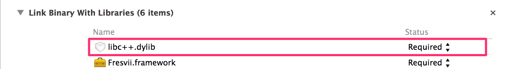
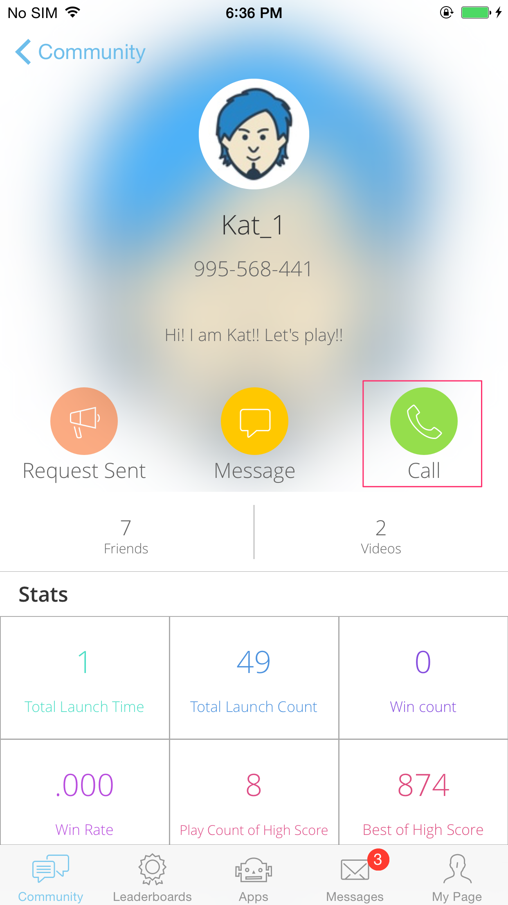
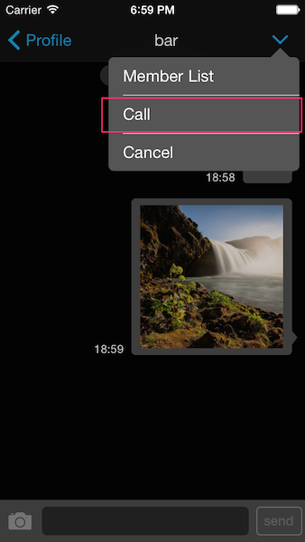
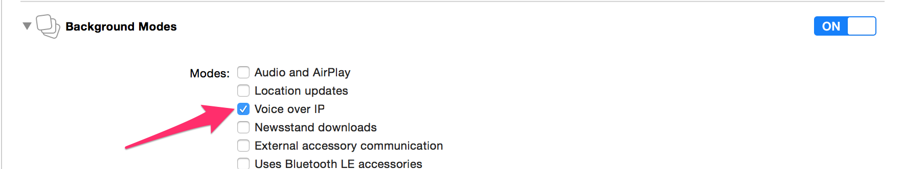

# Getting Started - Voice Chat

last update at 2014/10/7

---

- [ボイスチャットAPIの利用](#HowToUseAPI)
- [ボイスチャット画面を表示](#HowToDisplayView)
- [バックグラウンドモードでの利用](#BackgroundMode)

---

## <a name="HowToUseAPI"> ボイスチャットAPIの利用 </a>

### 導入
Fresviiのウェブサイトから`ボイスチャット機能ありのフレームワーク`をダウンロードしてください。
フレームワークの導入方法は[AppSteroid Get Started](../AppSteroidGetStarted.md)を参照してください。

また、`libc++.dylib`も下図の様にライブラリに追加してください。



### [FASConference](../Specs/Spec-VoiceChat.md)の利用

[FASConference](../Specs/Spec-VoiceChat.md)を利用することでボイスチャット機能を利用することが出来ます。

#### ボイスチャットの開始

ボイスチャットを開始するにはグループを作成している必要があります。
グループの作成は[GetStarted-GroupChat](GetStarted-GroupChat.md#HowToCreateGroup)を参照してください。
[FASConference](../Specs/Spec-VoiceChat.md)の[setupConferenceWithGroupId:completion:](../Specs/Spec-VoiceChat.md#FASConference.setupConferenceWithGroupIdcompletion)にグループIDを指定することでボイスチャットを開始することが出来ます。

Sample

```
- (void)startVoiceChat
{
    NSString *groupId = @"xxxxxxxxxxxxxxxxxxx";
    [FASConference setupConferenceWithGroupId:groupId
                                   completion:^(id response, NSError *error)
     {
         if (error)
         {
             // エラー
             return;
         }
         // ボイスチャットの開始
     }];
}
```

#### ボイスチャットに参加

ボイスチャットに参加するには既にボイスチャットが開始されている必要があります。
[FASConference](../Specs/Spec-VoiceChat.md)の[joinConferenceWithGroupId:completion:](../Specs/Spec-VoiceChat.md#FASConference.joinConferenceWithGroupIdcompletion)にグループIDを指定することでボイスチャットに参加することが出来ます。

Sample

```
- (void)joinVoiceChat
{
    NSString *groupId = @"xxxxxxxxxxxxxxxxxxx";
    [FASConference joinConferenceWithGroupId:groupId
                                  completion:^(id response, NSError *error)
    {
        if (error)
        {
            // エラー
            return;
        }
        // ボイスチャットに参加完了
    }];
}
```

#### ボイスチャットから脱退

参加中のボイスチャットから脱退します。
[FASConference](../Specs/Spec-VoiceChat.md)の[leaveConferenceWithCompletion:](../Specs/Spec-VoiceChat.md#FASConference.leaveConferenceWithCompletion)にグループIDを指定することでボイスチャットに参加することが出来ます。

Sample

```
- (void)leaveVoiceChat
{
    [FASConference leaveConferenceWithCompletion:^(id response, NSError *error)
    {
        if (error)
        {
            // エラー
            return;
        }
        // ボイスチャットから脱退成功
    }];
}
```

## <a name="HowToDisplayView"> ボイスチャット画面を表示 </a>

AppSteroidが提供するGUIからボイスチャットを利用することが可能です。
プロフィール画面からボイスチャットを利用するには、緑色の通話ボタンをタップします。1:1の通話が可能です。



グループチャット画面からボイスチャットを利用するには、右上のメニューからCallボタンをタップします。最大4人までのボイスチャットが利用可能です。



## <a name="BackgroundMode"> バックグラウンドモードでの利用 </a>
バックグラウンドに入るとアプリはスリープに入ります。それを防ぐにはアプリのinfo.plistにバックグラウンドでの動作を許すためにの許可を登録する必要があります。  
`Capabillities`の`Background Modes`で`Voice over IP`の設定をオンにすればバックグラウンド状態でもボイスチャットを利用することが可能になります。

