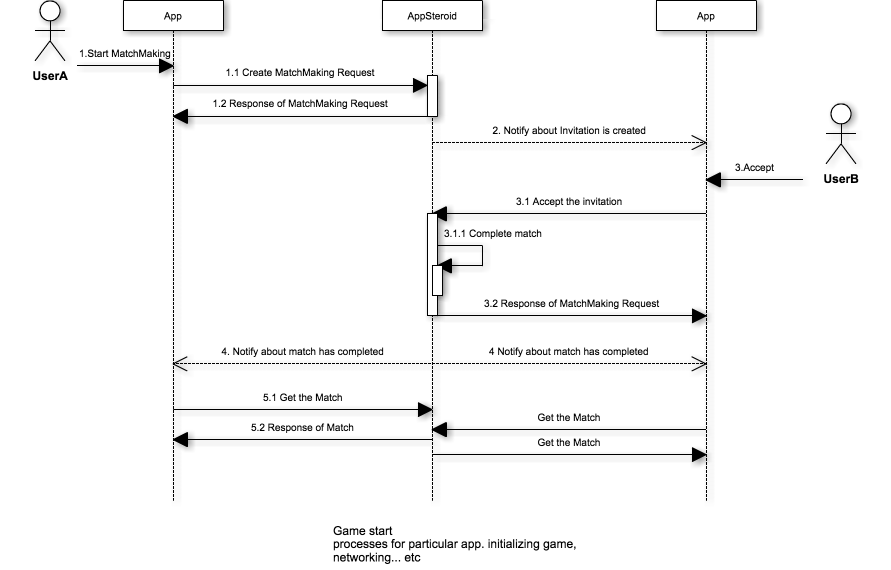
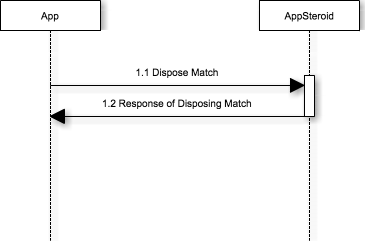

# Matchmaking Specifications

last update at 2015/4/2

---

## Introduction

マッチメイキングの機能に関する仕様書です。
一緒にゲームを行いたいユーザーを探すことが出来ます。
また、AppSteroidが提供するマッチメイキングのGUIも表示することが出来ます。
詳しい利用方法に関しては[MatchmakingGetStarted](../GetStarted/GetStarted-Matchmaking.md)を参照してください。

---

## Sequence

#### マッチメイク開始時（一般対戦）


- 1.1 ユーザによる新規マッチメイクリクエストの作成
- 1.2 リクエストの作成結果レスポンス Matchのstatus: FASMatchStatusWating
- 2.1 他のユーザによる新規マッチメイクリクエストの作成
- 3.1 (参加できるマッチが存在する場合) マッチに参加
- 3.2 (参加者がマッチの最大人数に達した場合) マッチが完了
- 2.2 リクエストの作成結果レスポンス Matchのstatus: FASMatchStatusComplete
- 4 マッチの参加者全員にマッチの完了イベントを通知
- 5.1 最新のマッチ招待情報を取得
- 5.2 マッチ詳細のレスポンス

#### マッチメイク開始時（招待による友人対戦）


- 1.1 ユーザによる新規マッチメイクリクエストの作成
- 1.2 リクエストの作成結果レスポンス Matchのstatus: FASMatchStatusInviting
- 2. 被招待者にマッチメイク招待イベントを通知
- 3.1 招待の承認
- 3.2 (参加者がマッチの最大人数に達した場合) マッチが完了
- 4 マッチの参加者全員にマッチの完了イベントを通知
- 5.1 最新のマッチ招待情報を取得
- 5.2 マッチ詳細のレスポンス




- 1.1 不要になったマッチの破棄
- 1.2 マッチ破棄の結果レスポンス Matchのstatus: FASMatchStatusDisposed

マッチのステータスは以下の順に遷移します。

1. FASMatchStatusWating: マッチの最大人数に達していない状態
2. (FASMatchStatusInviting): マッチの最大人数に達しているが招待の承認を待っている状態
3. FASMatchStatusComplete: マッチの最大人数に達した、または強制完了を実行した状態。ゲームが開始できる状態
4. FASMatchStatusDisposed: ゲームが終了し、マッチを破棄した状態


## Classes

|Class|Description|
|------|-----|
|[FASMatch](#FASMatch)|マッチモデルクラス |
|[FASMatchRequest](#FASMatchRequest)|マッチリクエストモデルクラス |
|[FASMatchPlayer](#FASMatchPlayer)|マッチプレイヤーモデルクラス |
|[FASMatchInvitation](#FASMatchInvitation)|マッチ招待モデルクラス |
|[FASGameContext](#FASGameContext)|ゲームコンテキストモデルクラス |
|[FASMatchmakingNavigationController](#FASMatchmakingNavigationController)|マッチメイキングのベースとなるNavigationController |

---

## APIs
### <a name="FASMatch"> FASMatch </a>
マッチモデルクラス。マッチリクエストやマッチの招待からマッチした際に作成されます。

#### Constants

|Constant|Description|
|------|-----|
|[FASMatchSearchingStatus](#FASMatch.FASMatchSearchingStatus)|複数のマッチを取得する際に絞り込むためのパラメータ。 |
|[FASMatchStatus](#FASMatch.FASMatchStatus)|マッチのステータス。 |
|[FASMatchCompletionHandler](#FASMatch.FASMatchCompletionHandler)|マッチ取得処理を行った際に利用されるブロックオブジェクト。 |
|[FASMatchesCompletionHandler](#FASMatch.FASMatchesCompletionHandler)|複数のマッチ取得処理を行った際に利用されるブロックオブジェクト。 |

##### <a name="FASMatch.FASMatchSearchingStatus"> FASMatchSearchingStatus </a>
複数のマッチを取得する際に絞り込むためのパラメータを定義しています。  [fetchMatchesWithPage:status:completion:](#FASMatch.fetchMatchesWithPagestatuscompletion)の`status`の引数で利用します。

```
typedef NS_ENUM(NSInteger, FASMatchSearchingStatus)
{
    FASMatchSearchingStatusMatching,
    FASMatchSearchingStatusComplete
};
```

###### Constants
###### FASMatchSearchingStatusMatching
プレイヤーが集まるのを待っていて、まだマッチが完了していない状態です。

###### FASMatchSearchingStatusComplete
マッチに必要なプレイヤーが全て集まりゲームが開始出来る準備が出来ている状態です。


#### <a name="FASMatch.FASMatchStatus"> FASMatchStatus </a>
マッチのステータスです。

```
typedef NS_ENUM(NSInteger, FASMatchStatus)
{
    FASMatchStatusInvalid = -1,
    FASMatchStatusWating,
    FASMatchStatusInviting,
    FASMatchStatusComplete,
    FASMatchStatusDisposed
};
```

###### Constants
###### FASMatchStatusInvalid
不正なステータスが返却された際に利用されます。

###### FASMatchStatusWating
マッチ作成中でプレイヤーが集まるのを待っている状態です。

###### FASMatchStatusInviting
招待中のプレイヤーを含めるとマッチに必要なプレイヤーが全て集まっている状態です。

###### FASMatchStatusComplete
マッチに必要なプレイヤーが全て集まり、ゲームが開始出来る状態です。

###### FASMatchStatusDisposed
ゲームが終了し、マッチが破棄されても良い状態です。

##### <a name="FASMatch.FASMatchCompletionHandler"> FASMatchCompletionHandler </a>
特定のマッチ取得処理を行った際に利用されるブロックオブジェクト。

typedef void (^ FASMatchCompletionHandler)(FASMatch *match, NSError *error);

* Parameters
	* match
		* [FASMatch](#FASMatch)が格納されています。
	* error
		* エラーの詳細が格納されています。エラーがない場合はnilになります。

##### <a name="FASMatch.FASMatchesCompletionHandler"> FASMatchesCompletionHandler </a>
複数のマッチ取得処理を行った際に利用されるブロックオブジェクト。

typedef void (^ FASMatchesCompletionHandler)(NSArray *matches, FASPagingMeta *meta, NSError *error);

* Parameters
	* matches
		* 複数の[FASMatch](#FASMatch)がNSArrayに格納されています。
	* meta
		* リストの総数や、現在のページ番号等のメタ情報を参照することが出来ます。詳しくは[FASPagingMeta](../7_Spec.md#FASPagingMeta)を参照して下さい。
	* error
		* エラーの詳細が格納されています。エラーがない場合はnilになります。

#### Properties

|Properties|Description|
|------|-----|
|[matchId](#FASMatch.matchId)|マッチID |
|[status](#FASMatch.status)|マッチの状態 |
|[currentMinPlayers](#FASMatch.currentMinPlayers)|現在の最小プレイヤー数 |
|[currentMaxPlayers](#FASMatch.currentMaxPlayers)|現在の最大プレイヤー数 |
|[createdAt](#FASMatch.createdAt)|マッチが作成された時刻 |
|[updatedAt](#FASMatch.updatedAt)|マッチが更新された時刻 |
|[players](#FASMatch.players)|マッチに参加中のプレイヤー |
|[groups](#FASMatch.groups)|マッチに参加中のプレイヤーのグループ |

##### <a name="FASMatch.matchId"> matchId </a>
マッチID

@property (nonatomic, readonly) NSString *matchId;

##### <a name="FASMatch.status"> status </a>
マッチの状態

@property (nonatomic, readonly) FASMatchStatus status;

##### <a name="FASMatch.currentMinPlayers"> currentMinPlayers </a>
現在の最小プレイヤー数

@property (nonatomic, readonly) NSUInteger currentMinPlayers;

##### <a name="FASMatch.currentMaxPlayers"> currentMaxPlayers </a>
現在の最大プレイヤー数

@property (nonatomic, readonly) NSUInteger currentMaxPlayers;

##### <a name="FASMatch.createdAt"> createdAt </a>
マッチが作成された時刻

@property (nonatomic, readonly) NSDate *createdAt;

##### <a name="FASMatch.updatedAt"> updatedAt </a>
マッチが更新された時刻

@property (nonatomic, readonly) NSDate *updatedAt;

##### <a name="FASMatch.players"> players </a>
マッチに参加中または招待中のプレイヤー。[FASMatchPlayer](#FASMatchPlayer)が格納されています。

@property (nonatomic, readonly) NSArray *players;

##### <a name="FASMatch.groups"> groups </a>
マッチ完了後の参加中のプレイヤーのグループ。[FASGroup](./Spec-Group.md#FASGroup)が格納されています。

@property (nonatomic, readonly) NSArray *groups;

#### Class Method

|Method|Description|
|------|-----|
|[fetchMatchWithMatchId:completion:](#FASMatch.fetchMatchWithMatchIdcompletion) |指定したマッチIDのマッチを取得します。 |
|[fetchMatchesWithPage:completion:](#FASMatch.fetchMatchesWithPagecompletion) |全てのマッチを取得します。 |
|[fetchMatchesWithPage:status:completion:](#FASMatch.fetchMatchesWithPagestatuscompletion) |指定したステータスのマッチを取得します。 |
|[joinMatchWithMatchId:completion:](#FASMatch.joinMatchWithMatchIdcompletion) |指定したマッチIDのマッチに参加します。 |
|[desposeMatchWithMatchId:completion:](#FASMatch.desposeMatchWithMatchIdcompletion) |指定したマッチIDのマッチを破棄します。 |
|[completeMatchWithMatchId:completion:](#FASMatch.completeMatchWithMatchIdcompletion) |指定したマッチIDのマッチを完了させます。 |


##### <a name="FASMatch.fetchMatchWithMatchIdcompletion"> fetchMatchWithMatchId:completion: </a>
指定したマッチIDのマッチを取得します。

\+ (void)fetchMatchWithMatchId:(NSString *)matchId
                    completion:(FASMatchCompletionHandler)completion;

* Parameters
	* matchId
		* マッチID
	* completion
		* 処理が完了した時に実行されるブロックオブジェクト

Sample

```
#import <AppSteroid/FASMatch.h>

	…
	…

- (IBAction)pushedFetchButton:(id)sender
{
    NSString *matchId = @“xxxxxxxxxxxxxxxxxx”;
  [FASMatch fetchMatchWithMatchId:matchId
                       completion:^(FASMatch *match, NSError *error)
  {
        // 処理が完了したら呼ばれます。
    }];
}
```

##### <a name="FASMatch.fetchMatchesWithPagecompletion"> fetchMatchesWithPage:completion: </a>
全てのマッチを取得します。

\+ (void)fetchMatchesWithPage:(NSUInteger)page
                   completion:(FASMatchesCompletionHandler)completion;

* Parameters
	* page
		* ページ番号
	* completion
		* 処理が完了した時に実行されるブロックオブジェクト

Sample

```
#import <AppSteroid/FASMatch.h>

	…
	…

- (IBAction)pushedFetchButton:(id)sender
{
  [FASMatch fetchMatchesWithPage:1
                     completion:^(NSArray *matches, FASPagingMeta *meta, NSError *error)
  {
        // 処理が完了したら呼ばれます。
    }];
}
```

##### <a name="FASMatch.fetchMatchesWithPagestatuscompletion"> fetchMatchesWithPage:status:completion: </a>
指定したステータスのマッチを取得します。

\+ (void)fetchMatchesWithPage:(NSUInteger)page
                       status:(FASMatchSearchingStatus)status
                   completion:(FASMatchesCompletionHandler)completion;

* Parameters
	* page
		* ページ番号
	* status
		* 取得したいマッチの状態。[FASMatchSearchingStatus](#FASMatch.FASMatchSearchingStatus)から選択します。
	* completion
		* 処理が完了した時に実行されるブロックオブジェクト

Sample

```
#import <AppSteroid/FASMatch.h>

	…
	…

- (IBAction)pushedFetchButton:(id)sender
{
  [FASMatch fetchMatchesWithPage:1
                          status:FASMatchSearchingStatusComplete
                      completion:^(NSArray *matches, FASPagingMeta *meta, NSError *error)
  {
        // 処理が完了したら呼ばれます。
    }];
}
```

##### <a name="FASMatch.joinMatchWithMatchIdcompletion"> joinMatchWithMatchId:completion: </a>
指定したマッチIDのマッチに参加します。

\+ (void)joinMatchWithMatchId:(NSString *)matchId
                   completion:(FASMatchCompletionHandler)completion;

* Parameters
	* matchId
		* マッチID
	* completion
		* 処理が完了した時に実行されるブロックオブジェクト

Sample

```
#import <AppSteroid/FASMatch.h>

	…
	…

- (IBAction)pushedJoinButton:(id)sender
{
    NSString *matchId = @“xxxxxxxxxxxxxxxxxx”;
  [FASMatch joinMatchWithMatchId:matchId
                      completion:^(NSMatch *match, NSError *error)
  {
        // 処理が完了したら呼ばれます。
    }];
}
```

##### <a name="FASMatch.desposeMatchWithMatchIdcompletion"> desposeMatchWithMatchId:completion: </a>
指定したマッチIDのマッチを破棄します。

\+ (void)desposeMatchWithMatchId:(NSString *)matchId
                      completion:(FASMatchCompletionHandler)completion;

* Parameters
	* matchId
		* マッチID
	* completion
		* 処理が完了した時に実行されるブロックオブジェクト

Sample

```
#import <AppSteroid/FASMatch.h>

	…
	…

- (IBAction)pushedDesposeButton:(id)sender
{
    NSString *matchId = @“xxxxxxxxxxxxxxxxxx”;
  [FASMatch desposeMatchWithMatchId:matchId
                         completion:^(NSMatch *match, NSError *error)
  {
        // 処理が完了したら呼ばれます。
    }];
}
```

##### <a name="FASMatch.completeMatchWithMatchIdcompletion"> completeMatchWithMatchId:completion: </a>
指定したマッチIDのマッチを完了させます。
必要人数に達していた場合は[FASMatchStatus](#FASMatch.FASMatchStatus)が`FASMatchStatusComplete`の状態になり、達していなかった場合は`FASMatchStatusDisposed`の状態になります。

\+ (void)completeMatchWithMatchId:(NSString *)matchId
                       completion:(FASMatchCompletionHandler)completion;

* Parameters
	* matchId
		* マッチID
	* completion
		* 処理が完了した時に実行されるブロックオブジェクト

### <a name="FASMatchPlayer"> FASMatchPlayer </a>
マッチプレイヤークラス。マッチに参加しているプレイヤーのモデルクラスです。

#### Constants

|Constant|Description|
|------|-----|
|[FASMatchPlayerStatus](#FASMatchPlayer.FASMatchPlayerStatus)|マッチプレイヤーの状態 |

##### <a name="FASMatchPlayer.FASMatchPlayerStatus"> FASMatchPlayerStatus </a>
マッチプレイヤーの状態

```
typedef NS_ENUM(NSInteger, FASMatchInvitationStatus)
{
    FASMatchPlayerStatusInvalid = -1,
    FASMatchPlayerStatusInvited,
    FASMatchPlayerStatusAccepted,
    FASMatchPlayerStatusMatched,
    FASMatchPlayerStatusDeclined,
    FASMatchPlayerStatusExpired,
    FASMatchPlayerStatusMatching
};
```

###### Constants
###### FASMatchPlayerStatusInvalid
不正なステータスが返却された際に利用されます。

###### FASMatchPlayerStatusInvited
マッチの招待を受け取った状態

###### FASMatchPlayerStatusAccepted
マッチの招待を承認した状態

###### FASMatchPlayerStatusMatched
マッチしている状態

###### FASMatchPlayerStatusDeclined
マッチの招待を拒否した状態

###### FASMatchPlayerStatusExpired
マッチリクエストが時間切れになった状態

###### FASMatchPlayerStatusMatching
マッチを探している状態

#### Properties

|Properties|Description|
|------|-----|
|[requestId](#FASMatchRequest.requestId)|マッチリクエストID |
|[status](#FASMatchPlayer.status)|マッチプレイヤーの状態 |
|[user](#FASMatchPlayer.user)|プレイヤーの情報 |
|[match](#FASMatchRequest.match)|マッチした際に取得出来るマッチオブジェクト |
|[createdAt](#FASMatchRequest.createdAt)|マッチリクエストが作成された時刻 |
|[updatedAt](#FASMatchRequest.updatedAt)|マッチリクエストが更新された時刻 |

##### <a name="FASMatchRequest.requestId"> requestId </a>
マッチリクエストID

@property (nonatomic, readonly) NSString *requestId;
##### <a name="FASMatchPlayer.status"> status </a>
マッチプレイヤーの状態

@property (nonatomic, readonly) FASMatchPlayerStatus status;

##### <a name="FASMatchPlayer.user"> user </a>
プレイヤーの情報

@property (nonatomic, readonly) FASUser *user;

##### <a name="FASMatchRequest.match"> match </a>
マッチした際に取得出来るマッチオブジェクト

@property (nonatomic, readonly) FASMatch *match;

##### <a name="FASMatchRequest.createdAt"> createdAt </a>
マッチリクエストが作成された時刻

@property (nonatomic, readonly) NSDate *createdAt;

##### <a name="FASMatchRequest.updatedAt"> updatedAt </a>
マッチリクエストが更新された時刻

@property (nonatomic, readonly) NSDate *updatedAt;


### <a name="FASMatchRequest"> FASMatchRequest </a>
マッチリクエストモデルクラス。マッチしたいときにリクエストを作成します。
[FASMatchPlayer](#FASMatchPlayer)が親クラスです。

#### Constants

|Constant|Description|
|------|-----|
|[FASMatchRequestStatus](#FASMatchRequest.FASMatchRequestStatus)|マッチリクエストのステータス。|
|[FASMatchRequestCompletionHandler](#FASMatchRequest.FASMatchRequestCompletionHandler)|マッチリクエスト取得処理を行った際に利用されるブロックオブジェクト。 |

##### <a name="FASMatch.FASMatchSearchingStatus"> FASMatchSearchingStatus </a>
マッチリクエストのステータスです。

```
typedef NS_ENUM(NSInteger, FASMatchRequestStatus)
{
    FASMatchRequestStatusInvalid = -1,
    FASMatchRequestStatusMatching,
    FASMatchRequestStatusMatched
};
```

###### Constants
###### FASMatchRequestStatusInvalid
不正なステータスが返却された際に利用されます。

###### FASMatchRequestStatusMatching
対戦相手を捜している状態です。

###### FASMatchRequestStatusMatched
対戦相手が見つかりマッチした状態です。

##### <a name="FASMatchRequest.FASMatchRequestCompletionHandler"> FASMatchRequestCompletionHandler </a>
マッチリクエスト取得処理を行った際に利用されるブロックオブジェクト。

typedef void (^FASMatchRequestCompletionHandler)(FASMatchRequest *matchRequest, NSError *error);

* Parameters
	* matchRequest
		* [FASMatchRequest](#FASMatchRequest)が格納されています。
	* error
		* エラーの詳細が格納されています。エラーがない場合はnilになります。

#### Properties

|Properties|Description|
|------|-----|
|[segment](#FASMatchRequest.segment)|マッチのセグメント。同じセグメントを持っているユーザーとのみマッチします。 |
|[minNumberOfPlayers](#FASMatchRequest.minNumberOfPlayers)|リクエストした最小プレイヤー数 |
|[maxNumberOfPlayers](#FASMatchRequest.maxNumberOfPlayers)|リクエストした最大プレイヤー数 |
|[invitations](#FASMatchRequest.invitations)|招待を送ったユーザーの配列 |

##### <a name="FASMatchRequest.segment"> segment </a>
マッチのセグメント。同じセグメントを持っているユーザーとのみマッチします。

@property (nonatomic, readonly) NSString *segment;

##### <a name="FASMatchRequest.minNumberOfPlayers"> minNumberOfPlayers </a>
リクエストした最小プレイヤー数

@property (nonatomic, readonly) NSUInteger minNumberOfPlayers;

##### <a name="FASMatchRequest.maxNumberOfPlayers"> maxNumberOfPlayers </a>
リクエストした最大プレイヤー数

@property (nonatomic, readonly) NSUInteger maxNumberOfPlayers;

##### <a name="FASMatchRequest.invitations"> invitations </a>
招待を送ったユーザーの配列

@property (nonatomic, readonly) NSArray/*<FASMatchInvitation>*/ *invitations;

#### Class Method

|Method|Description|
|------|-----|
|[createMatchRequestWithCompletion:](#FASMatchRequest.createMatchRequestWithCompletion) |マッチリクエストを作成します。 |
|[createMatchRequestWithMinNumberOfPlayers:maxNumberOfPlayers:segment:completion:](#FASMatchRequest.createMatchRequestWithMinNumberOfPlayersmaxNumberOfPlayerssegmentcompletion) |最小と最大のゲームプレイヤー数とセグメントを指定してマッチリクエストを作成します。 |
|[createMatchRequestWithMinNumberOfPlayers:maxNumberOfPlayers:inviteUsers:inviteMessages:segment:completion:](#FASMatchRequest.createMatchRequestWithMinNumberOfPlayersmaxNumberOfPlayersinviteUsersinviteMessagessegmentcompletion) |最小と最大のゲームプレイヤー数とセグメント、招待するユーザーと招待メッセージを指定してマッチリクエストを作成します。 |
[createMatchRequestWithMinNumberOfPlayers:maxNumberOfPlayers:inviteUsers:inviteMessages:segment:cancelOnDecline:completion:](#FASMatchRequest.createMatchRequestWithMinNumberOfPlayersmaxNumberOfPlayersinviteUsersinviteMessagessegmentcancelOnDeclinecompletion) |最小と最大のゲームプレイヤー数とセグメント、招待するユーザーと招待メッセージ、招待キャンセル時の挙動を指定してマッチリクエストを作成します。 |
|[cancelMatchRequestWithRequestId:completion:](#FASMatchRequest.cancelMatchRequestWithRequestIdcompletion) |マッチリクエストを破棄します。 |
|[fetchMatchingRequestWithCompletion:](#FASMatchRequest.fetchMatchingRequestWithCompletion) |自分のマッチリクエストを取得します。 |

##### <a name="FASMatchRequest.createMatchRequestWithCompletion"> createMatchRequestWithCompletion: </a>
マッチリクエストを作成します。

\+ (void)createMatchRequestWithCompletion:(FASMatchRequestCompletionHandler)completion;

* Parameters
	* completion
		* 処理が完了した時に実行されるブロックオブジェクト

Sample

```
#import <AppSteroid/FASMatchRequest.h>

	…
	…

- (IBAction)pushedCreateButton:(id)sender
{
  [FASMatchRequest createMatchRequestWithCompletion:^(FASMatchRequest *matchRequest, NSError *error)
  {
        // 処理が完了したら呼ばれます。
    }];
}
```

##### <a name="FASMatchRequest.createMatchRequestWithMinNumberOfPlayersmaxNumberOfPlayerssegmentcompletion"> createMatchRequestWithMinNumberOfPlayers:maxNumberOfPlayers:segment:completion: </a>
最小と最大のゲームプレイヤー数とセグメントを指定してマッチリクエストを作成します。

\+ (void)createMatchRequestWithMinNumberOfPlayers:(NSUInteger)minNumber
                               maxNumberOfPlayers:(NSUInteger)maxNumber
                                          segment:(NSString *)segment
                                       completion:(FASMatchRequestCompletionHandler)completion;

* Parameters
	* minNumber
		* 最小のプレイヤー数。2~16の間で指定出来ます。
	* maxNumber
		* 最大のプレイヤー数。2~16の間で指定出来ます。
	* segment
		* 指定した場合、同じセグメントを設定している対象とのみマッチします。
	* completion
		* 処理が完了した時に実行されるブロックオブジェクト

Sample

```
#import <AppSteroid/FASMatchRequest.h>

	…
	…

- (IBAction)pushedCreateButton:(id)sender
{
  [FASMatchRequest createMatchRequestWithMinNumberOfPlayers:3
                                         maxNumberOfPlayers:6
                                                    segment:@“beginner”
                                                 completion:^(FASMatchRequest *matchRequest, NSError *error)
  {
        // 処理が完了したら呼ばれます。
    }];
}
```

##### <a name="FASMatchRequest.createMatchRequestWithMinNumberOfPlayersmaxNumberOfPlayersinviteUsersinviteMessagessegmentcompletion"> createMatchRequestWithMinNumberOfPlayers:maxNumberOfPlayers:inviteUsers:inviteMessages:segment:completion: </a>
最小と最大のゲームプレイヤー数とセグメント、招待するユーザーと招待メッセージを指定してマッチリクエストを作成します。

\+ (void)createMatchRequestWithMinNumberOfPlayers:(NSUInteger)minNumber
                               maxNumberOfPlayers:(NSUInteger)maxNumber
                                      inviteUsers:(NSArray *)users
                                   inviteMessages:(NSArray *)messages
                                          segment:(NSString *)segment
                                       completion:(FASMatchRequestCompletionHandler)completion;

* Parameters
	* minNumber
		* 最小のプレイヤー数。2~16の間で指定出来ます。
	* maxNumber
		* 最大のプレイヤー数。2~16の間で指定出来ます。
	* users
		* 招待するユーザーのIDを配列で指定します。
	* messages
		* 招待するユーザーに招待用のメッセージを指定します。
	* segment
		* 指定した場合、同じセグメントを設定している対象とのみマッチします。
	* completion
		* 処理が完了した時に実行されるブロックオブジェクト

Sample

```
#import <AppSteroid/FASMatchRequest.h>

	…
	…

- (IBAction)pushedCreateButton:(id)sender
{
    NSArray *users = @[@“xxxxxxxxxxxxx”, @“yyyyyyyyyyyyyyyy”];
    NSArray *messages = @[@“Let’s play!”, @“Let’s play!”];
  [FASMatchRequest createMatchRequestWithMinNumberOfPlayers:3
                                         maxNumberOfPlayers:6
                                                inviteUsers:users
                                             inviteMessages:messages
                                                    segment:@“beginner”
                                                 completion:^(FASMatchRequest *matchRequest, NSError *error)
  {
        // 処理が完了したら呼ばれます。
    }];
}
```

##### <a name="FASMatchRequest.createMatchRequestWithMinNumberOfPlayersmaxNumberOfPlayersinviteUsersinviteMessagessegmentcancelOnDeclinecompletion"> createMatchRequestWithMinNumberOfPlayers:maxNumberOfPlayers:inviteUsers:inviteMessages:segment:cancelOnDecline:completion: </a>
最小と最大のゲームプレイヤー数とセグメント、招待するユーザーと招待メッセージを指定してマッチリクエストを作成します。

\+ (void)createMatchRequestWithMinNumberOfPlayers:(NSUInteger)minNumber
                               maxNumberOfPlayers:(NSUInteger)maxNumber
                                      inviteUsers:(NSArray *)users
                                   inviteMessages:(NSArray *)messages
                                          segment:(NSString *)segment
                                  cancelOnDecline:(BOOL)cancelOnDecline
                                       completion:(FASMatchRequestCompletionHandler)completion;

* Parameters
	* minNumber
		* 最小のプレイヤー数。2~16の間で指定出来ます。
	* maxNumber
		* 最大のプレイヤー数。2~16の間で指定出来ます。
	* users
		* 招待するユーザーのIDを配列で指定します。
	* messages
		* 招待するユーザーに招待用のメッセージを指定します。
	* segment
		* 指定した場合、同じセグメントを設定している対象とのみマッチします。
	* cancelOnDecline
		* 招待をdeclineした時はの挙動を決定します。
		  `YES`の場合: 招待をキャンセルし、マッチは参加者待ち状態になります。この時、他の参加者が参加可能になります。
          `NO`の場合: 招待はキャンセルされず、declined ステータスのままマッチに残ります。参加者数がマッチの現在の最大参加者数に達している場合は他の参加者は参加できません。
	* completion
		* 処理が完了した時に実行されるブロックオブジェクト

##### <a name="FASMatchRequest.acceptMatchRequestWithRequestIdcompletion"> acceptMatchRequestWithRequestId:completion: </a>
マッチの招待を承認します。

\+ (void)acceptMatchRequestWithRequestId:(NSString *)requestId
                              completion:(FASMatchRequestCompletionHandler)completion;

* Parameters
	* requestId
		* リクエストID
	* completion
		* 処理が完了した時に実行されるブロックオブジェクト

Sample

```
#import <AppSteroid/FASMatchRequest.h>

	…
	…

- (IBAction)pushedAcceptButton:(id)sender
{
  [FASMatchRequest acceptMatchRequestWithRequestId:@“xxxxxxxxxxxxxxxx”
                                        completion:^(FASMatchRequest *matchRequest, NSError *error)
  {
        // 処理が完了したら呼ばれます。
    }];
}
```

#### <a name="FASMatchRequest.cancelMatchRequestWithRequestIdcompletion"> cancelMatchRequestWithRequestId:completion: </a>
マッチの招待を辞退します。

\+ (void)cancelMatchRequestWithRequestId:(NSString *)requestId
                              completion:(FASMatchRequestCompletionHandler)completion;

* Parameters
	* requestId
		* リクエストID
	* completion
		* 処理が完了した時に実行されるブロックオブジェクト

Sample

```
#import <AppSteroid/FASMatchRequest.h>

	…
	…

- (IBAction)pushedCancelButton:(id)sender
{
  [FASMatchRequest cancelMatchRequestWithRequestId:@“xxxxxxxxxxxxxxxx”
                                        completion:^(FASMatchRequest *matchRequest, NSError *error)
  {
        // 処理が完了したら呼ばれます。
    }];
}
```

#### <a name="FASMatchRequest.fetchMatchingRequestWithCompletion"> fetchMatchingRequestWithCompletion: </a>
マッチの招待を辞退します。

\+ (void)fetchMatchingRequestWithCompletion:(FASMatchRequestCompletionHandler)completion;

* Parameters
	* completion
		* 処理が完了した時に実行されるブロックオブジェクト

Sample

```
#import <AppSteroid/FASMatchRequest.h>

	…
	…

- (IBAction)pushedFetchButton:(id)sender
{
  [FASMatchRequest fetchMatchingRequestWithCompletion:^(FASMatchRequest *matchRequest, NSError *error)
  {
        // 処理が完了したら呼ばれます。
    }];
}
```


### <a name="FASMatchInvitation"> FASMatchInvitation </a>
マッチ招待モデルクラス。マッチリクエストからプレイヤーを招待した際に作成されます。
[FASMatchPlayer](#FASMatchPlayer)が親クラスです。

#### Properties

|Properties|Description|
|------|-----|
|[invitationMessage](#FASMatchInvitation.invitationMessage)|招待のメッセージ |
|[invitingUser](#FASMatchInvitation.invitingUser)|招待したユーザー |

##### <a name="FASMatchInvitation.invitationMessage"> invitationMessage </a>
招待のメッセージ

@property (nonatomic, readonly) NSString *invitationMessage;

##### <a name="FASMatchInvitation.invitingUser"> invitingUser </a>
招待したユーザー

@property (nonatomic, readonly) FASUser *invitingUser;

#### Class Method

|Method|Description|
|------|-----|
|[inviteUserWithRequestId:opponentUserId:message:cancelOnDecline:completion:](#FASMatchInvitation.inviteUserWithRequestIdopponentUserIdmessagecancelOnDeclinecompletion) |既に存在しているリクエストに対してユーザーを追加します。 |
|[acceptMatchRequestWithRequestId:completion:](#FASMatchInvitation.acceptMatchRequestWithRequestIdcompletion) |招待を承認します。 |
|[declineMatchRequestWithRequestId:completion:](#FASMatchInvitation.declineMatchRequestWithRequestIdcompletion) |招待を拒否します。 |

##### <a name="FASMatchInvitation.inviteUserWithRequestIdopponentUserIdmessagecancelOnDeclinecompletion"> inviteUserWithRequestId:opponentUserId:message:cancelOnDecline:completion: </a>
既に存在しているリクエストに対してユーザーを追加します。

\+ (void)inviteUserWithRequestId:(NSString *)requestId
                 opponentUserId:(NSString *)userId
                        message:(NSString *)message
                cancelOnDecline:(BOOL)cancelOnDecline
                     completion:(FASMatchInvitationCompletionHandler)completion;

* Parameters
	* requestId
		* リクエストID
	* userId
		* 招待したい相手のユーザーID
	* message
		* 招待のメッセージ
	* cancelOnDecline
		* 招待をdeclineした時はの挙動を決定します。
		  `YES`の場合: 招待をキャンセルし、マッチは参加者待ち状態になります。この時、他の参加者が参加可能になります。
          `NO`の場合: 招待はキャンセルされず、declined ステータスのままマッチに残ります。参加者数がマッチの現在の最大参加者数に達している場合は他の参加者は参加できません。
	* completion
		* 処理が完了した時に実行されるブロックオブジェクト

##### <a name="FASMatchInvitation.acceptMatchRequestWithRequestIdcompletion"> acceptMatchRequestWithRequestId:completion: </a>
招待を承認します。

\+ (void)acceptMatchRequestWithRequestId:(NSString *)requestId
                             completion:(FASMatchInvitationCompletionHandler)completion;

* Parameters
	* requestId
		* リクエストID
	* completion
		* 処理が完了した時に実行されるブロックオブジェクト

##### <a name="FASMatchInvitation.declineMatchRequestWithRequestIdcompletion"> declineMatchRequestWithRequestId:completion: </a>
招待を拒否します。

\+ (void)acceptMatchRequestWithRequestId:(NSString *)requestId
                             completion:(FASMatchInvitationCompletionHandler)completion;

* Parameters
	* requestId
		* リクエストID
	* completion
		* 処理が完了した時に実行されるブロックオブジェクト


### <a name="FASGameContext"> FASGameContext </a>
ゲームコンテキストモデルクラス。マッチメイクが成立した際に自動で作成されるオブジェクトで、ゲーム情報を格納しユーザー感で共有する為に利用されます。

#### Constants

|Constant|Description|
|------|-----|
|[FASGameContextCompletionHandler](#FASGameContext.FASGameContextCompletionHandler)|ゲームコンテキスト取得処理を行った際に利用されるブロックオブジェクト |

##### <a name="FASGameContext.FASGameContextCompletionHandler"> FASGameContextCompletionHandler </a>
ゲームコンテキスト取得処理を行った際に利用されるブロックオブジェクト

typedef void (^FASGameContextCompletionHandler)(FASGameContext *gameContext, NSError *error);

* Parameters
	* gameContext
		* [FASGameContext](#FASGameContext)が格納されています。
	* error
		* エラーの詳細が格納されています。エラーがない場合はnilになります。

#### Properties

|Properties|Description|
|------|-----|
|[value](#FASGameContext.value)|ゲームコンテキストの内容 |
|[updatedCount](#FASGameContext.updatedCount)|何回更新されたかのカウント |
|[updatedAt](#FASGameContext.updatedAt)|更新時刻 |
|[nextPlayer](#FASGameContext.nextPlayer)|次作業して欲しいプレイヤー |
|[updatedUser](#FASGameContext.updatedUser)|コンテキストを更新したプレイヤー |

##### <a name="FASGameContext.value"> value </a>
ゲームコンテキストの内容

@property (nonatomic, readonly) NSDictionary *value;

##### <a name="FASGameContext.updatedCount"> updatedCount </a>
何回更新されたかのカウント

@property (nonatomic, readonly) NSInteger updatedCount;

##### <a name="FASGameContext.updatedAt"> updatedAt </a>
ゲームコンテキストの内容

@property (nonatomic, readonly) NSDate *updatedAt;

##### <a name="FASGameContext.nextPlayer"> nextPlayer </a>
ゲームコンテキストの内容

@property (nonatomic, readonly) FASUser *nextPlayer;

##### <a name="FASGameContext.updatedUser"> updatedUser </a>
ゲームコンテキストの内容

@property (nonatomic, readonly) FASUser *updatedUser;

#### Class Method

|Method|Description|
|------|-----|
|[updateGameContextWithMatchId:value:completion:](#FASGameContext.updateGameContextWithMatchIdvaluecompletion) |ゲームコンテキストを更新します。 |
|[updateGameContextWithMatchId:value:nextPlayerId:completion:](#FASGameContext.updateGameContextWithMatchIdvaluenextPlayerIdcompletion) |次に作業してほしいユーザーを指定してゲームコンテキストを更新します。 |
|[updateGameContextWithMatchId:value:nextPlayerId:updatedCount:completion:](#FASGameContext.updateGameContextWithMatchIdvaluenextPlayerIdupdatedCountcompletion) |ゲームコンテキストを更新します。指定したアップデートカウントが本来の値と違った場合はエラーが返却されます。 |
|[fetchGameContextWithMatchId:completion:](#FASGameContext.fetchGameContextWithMatchIdcompletion) |ゲームコンテキストを取得します。 |

##### <a name="FASGameContext.updateGameContextWithMatchIdvaluecompletion"> updateGameContextWithMatchId:value:completion: </a>
ゲームコンテキストを更新します。

\+ (void)updateGameContextWithMatchId:(NSString *)matchId
                               value:(NSDictionary *)value
                          completion:(FASGameContextCompletionHandler)completion;

* Parameters
	* matchId
		* マッチID
	* value
		* ゲームコンテキスト内で管理したい値を`NSDictionary`型で指定します。
	* completion
		* 処理が完了した時に実行されるブロックオブジェクト

##### <a name="FASGameContext.updateGameContextWithMatchIdvaluenextPlayerIdcompletion"> updateGameContextWithMatchId:value:nextPlayerId:completion: </a>
次に作業してほしいユーザーを指定してゲームコンテキストを更新します。

\+ (void)updateGameContextWithMatchId:(NSString *)matchId
                               value:(NSDictionary *)value
                        nextPlayerId:(NSString *)nextPlayerId
                          completion:(FASGameContextCompletionHandler)completion;

* Parameters
	* matchId
		* マッチID
	* value
		* ゲームコンテキスト内で管理したい値を`NSDictionary`型で指定します。
	* nextPlayerId
		* 次のプレイヤーのユーザーIDを指定します。
	* completion
		* 処理が完了した時に実行されるブロックオブジェクト

##### <a name="FASGameContext.updateGameContextWithMatchIdvaluenextPlayerIdupdatedCountcompletion"> updateGameContextWithMatchId:value:nextPlayerId:updatedCount:completion: </a>
ゲームコンテキストを更新します。指定したアップデートカウントが本来の値と違った場合はエラーが返却されます。

\+ (void)updateGameContextWithMatchId:(NSString *)matchId
                               value:(NSDictionary *)value
                        nextPlayerId:(NSString *)nextPlayerId
                        updatedCount:(NSUInteger)updatedCount
                          completion:(FASGameContextCompletionHandler)completion;

* Parameters
	* matchId
		* マッチID
	* value
		* ゲームコンテキスト内で管理したい値を`NSDictionary`型で指定します。
	* nextPlayerId
		* 次のプレイヤーのユーザーIDを指定します。
	* updatedCount
		* アップデートカウントを指定します。指定したアップデートカウントが本来の値と違った場合はエラーが返却されます。
	* completion
		* 処理が完了した時に実行されるブロックオブジェクト

##### <a name="FASGameContext.fetchGameContextWithMatchIdcompletion"> fetchGameContextWithMatchId:completion: </a>
ゲームコンテキストを取得します。

\+ (void)fetchGameContextWithMatchId:(NSString *)matchId
                         completion:(FASGameContextCompletionHandler)completion;

* Parameters
	* matchId
		* マッチID
	* completion
		* 処理が完了した時に実行されるブロックオブジェクト

### <a name="FASMatchmakingNavigationController"> FASMatchmakingNavigationController </a>
マッチメイキングのベースとなるNavigationController

#### Properties

|Properties|Description|
|------|-----|
|[animated](#FASMatchmakingNavigationController.animated)|ビューを閉じるときのアニメーション有無 |
|[matchmakingViewController](#FASMatchmakingNavigationController.matchmakingViewController)|[FASMatchmakingViewController](#FASMatchmakingViewController)を返却します。 |

##### <a name="FASMatchmakingNavigationController.animated"> animated </a>
ビューを閉じるときのアニメーション有無

@property (nonatomic, assign) BOOL animated;

##### <a name="FASMatchmakingNavigationController.matchmakingViewController"> matchmakingViewController </a>
[FASMatchmakingViewController](#FASMatchmakingViewController)を返却します。

@property (nonatomic, readonly) FASMatchmakingViewController *matchmakingViewController;

#### Class Method

|Method|Description|
|------|-----|
|[matchmakingNavigationController](#FASMatchmakingNavigationController.matchmakingNavigationController) |マッチメイキングビューのベースとなる[FASMatchmakingNavigationController](#FASMatchmakingNavigationController)を返却します。 |
|[presentMatchmakingWithTarget:animated:](#FASMatchmakingNavigationController.presentMatchmakingWithTargetanimated) |マッチメイキングビューを表示します。 |

##### <a name="FASMatchmakingNavigationController.matchmakingNavigationController"> matchmakingNavigationController </a>
マッチメイキングビューのベースとなる[FASMatchmakingNavigationController](#FASMatchmakingNavigationController)を返却します。

\+ (FASMatchmakingNavigationController *)matchmakingNavigationController;

##### <a name="FASMatchmakingNavigationController.presentMatchmakingWithTargetanimated"> presentMatchmakingWithTarget:animated: </a>
マッチメイキングビューを表示します。

\+ (void)presentMatchmakingWithTarget:(UIViewController *)target
                             animated:(BOOL)animated;

* Parameters
	* target
		* ビューを表示する元となるViewControllerを指定します。
	* animated
		* YESならアニメーションさせて遷移します。NOならアニメーションはしません。

Sample

```
#import <AppSteroid/FASMatchmakingNavigationController.h>

	…
	…

- (IBAction)pushedMatchmakingButton:(id)sender
{
    [FASMatchmakingNavigationController presentMatchmakingWithTarget:self
                                                            animated:YES];
}
```

### <a name="FASMatchmakingViewController"> FASMatchmakingViewController </a>
マッチメイキングを実際に行うViewController

#### Properties

|Properties|Description|
|------|-----|
|[matchmakingDelegate](#FASMatchmakingNavigationController.matchmakingDelegate)|[FASMatchmakingNavigationControllerDelegate](#FASMatchmakingNavigationControllerDelegate)の通知を受けるクラスを指定します。 |
|[minNumberOfPlayers](#FASMatchmakingNavigationController.minNumberOfPlayers)|マッチに必要な最小プレイヤー数を指定します。 |
|[maxNumberOfPlayers](#FASMatchmakingNavigationController.maxNumberOfPlayers)|マッチに必要な最大プレイヤー数を指定します。 |
|[timeout](#FASMatchmakingNavigationController.timeout)|マッチメイキングのタイムアウト時間を指定します。 |
|[segment](#FASMatchmakingNavigationController.segment)|マッチのセグメントを指定します。同様のセグメントが指定されているユーザーとのみマッチします。 |

##### <a name="FASMatchmakingViewController.matchmakingDelegate"> matchmakingDelegate </a>
[FASMatchmakingViewControllerDelegate](#FASMatchmakingViewControllerDelegate)の通知を受けるクラスを指定します。

@property (nonatomic, weak) id<FASMatchmakingNavigationControllerDelegate> matchmakingDelegate;

##### <a name="FASMatchmakingViewController.minNumberOfPlayers"> minNumberOfPlayers </a>
マッチに必要な最小プレイヤー数を指定します。デフォルトは２です。

@property (nonatomic, assign) NSUInteger minNumberOfPlayers;

##### <a name="FASMatchmakingViewController.maxNumberOfPlayers"> maxNumberOfPlayers </a>
マッチに必要な最大プレイヤー数を指定します。デフォルトは２です。

@property (nonatomic, assign) NSUInteger maxNumberOfPlayers;

##### <a name="FASMatchmakingViewController.timeout"> timeout </a>
マッチメイキングのタイムアウト時間を指定します。デフォルトは30秒です。

@property (nonatomic, assign) NSUInteger timeout;

##### <a name="FASMatchmakingViewController.segment"> segment </a>
マッチのセグメントを指定します。同様のセグメントが指定されているユーザーとのみマッチします。

@property (nonatomic, strong) NSString *segment;

#### <a name="FASMatchmakingViewControllerDelegate"> FASMatchmakingViewControllerDelegate </a>
[FASMatch](#FASMatch)オブジェクトの状態を監視して変更された際に呼ばれるデリゲートメソッド。

|Method|Description|
|------|-----|
|[FASMatchmakingViewController:matchingWasCompleted:](#FASMatchmakingViewControllerDelegate.FASMatchmakingViewControllermatchingWasCompleted) |[FASMatch](#FASMatch)オブジェクトの状態が`FASMatchStatusComplete`になった際に呼ばれる関数 |

##### <a name="FASMatchmakingViewControllerDelegate.FASMatchmakingViewControllermatchingWasCompleted"> FASMatchmakingViewController:matchingWasCompleted: </a>
[FASMatch](#FASMatch)オブジェクトの状態が`FASMatchStatusComplete`になった際に呼ばれる関数

\- (void)matchingWasCompleted:(FASMatch *)match;

* Parameters
	* match
		* `complete`状態になっている[FASMatch](#FASMatch)オブジェクトが格納されています。
